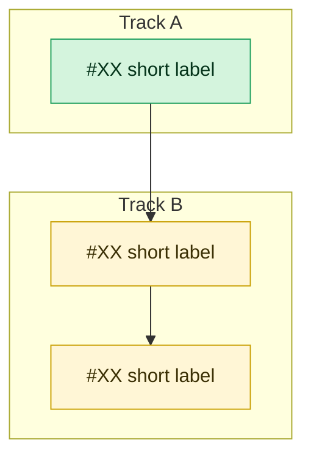

<!--
HOW TO USE THIS TEMPLATE
- This is for EPIC / tracking issues (a milestone or version), not individual work items.
- Add the milestone's domain label(s) after creating (runs / identity / models / …).
- Link each child issue as a GitHub sub-issue of this one (Issues sidebar → "Add sub-issue").
- Keep child issues as the source of truth for scope/acceptance; this body is the map.
- Delete every <!-- comment --> and replace <angle-bracket> placeholders before submitting.
- The mermaid block renders on GitHub — keep it in sync when tracks/deps change.
-->

## <vX.Y>: <one-line milestone name>

<!-- 2–3 sentences: the smallest useful version of this milestone, and what is explicitly deferred to later milestones. -->

### Architecture overview

<!-- Optional. A short paragraph on how the pieces fit, referencing child issues by #number and the relevant SPEC.md section(s). Remove if not useful. -->

### Key design decisions

<!-- Optional. The load-bearing choices for this milestone (one bullet each, with the "why"). Remove if not useful. -->

- <decision — and why>
- <decision — and why>

## Tracks

<!--
Group child issues into a few named tracks by concern (e.g. "Persistence", "Model", "Auth", "Loop").
Foundations first; the track that consumes them last. Mark shipped items [x], annotate cross-issue deps inline.
Use one ### per track. An emoji prefix is optional but makes the rendered tracker scannable.
-->

### <emoji> <Track A name> — <one-line purpose>

- [ ] #XX — <child issue title> _(requires #YY)_
- [ ] #XX — <child issue title>

### <emoji> <Track B name> — <one-line purpose>

- [x] #XX — <child issue title> _(shipped)_
- [ ] #XX — <child issue title> _(requires #XX)_

### Track & dependency graph

<!--
Generalize this skeleton: one `subgraph` per track, intra-track edges inside it,
cross-track dependency edges below. Tag nodes done/todo via classDef so status is visible.
Edge direction = "A enables B" (blocker → blocked).
-->

### Build order

<!-- The dependency-respecting sequence. "In parallel" where tracks are independent. -->

1. **Foundations (parallel):** <tracks/issues with no blockers>
2. **<next>:** <issues unblocked once step 1 lands>
3. **Release gate:** <hardening / eval / test issues>

### Success criteria

<!-- Observable, testable conditions that close this milestone. The release gate, not a feature list. -->

- <criterion>
- <criterion>
