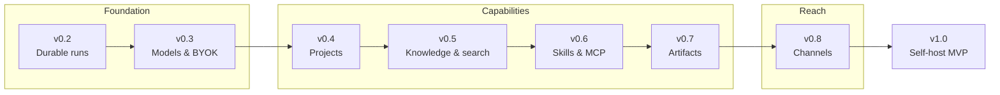

# llame Roadmap

Forward-looking plan toward a self-hostable MVP (**v1.0**) — the work that is **not yet done**. Rationale and detail for every milestone live in [SPEC.md](SPEC.md).

**Now:** a chat proof-of-concept (auth, model selection, persisted chats, agent orchestration).
**Next:** the durable-run pipeline and governance foundation everything else plugs into.

## Guiding principles

1. **Durable state over prompt tricks** — todos, goals, memories, runs, artifacts, and tool calls are structured data, not hidden chat text.
2. **Policy before capability** — a tool/model/skill is available only if effective policy allows it; deny overrides allow.
3. **Config is inherited, resolved, and snapshotted** — every run stores the effective config it ran with.
4. **BYOK means user-owned** — the instance works with no provider configured; users supply their own.
5. **Wiki is memory** — personal/team knowledge is a continuously indexed source of truth, not a side upload.
6. **Every long-running operation is resumable** — clients are subscribers to an event log, not holders of fragile state.

## Release timeline

## v0.2 — Foundations & durable runs

The keystone — most later milestones depend on it.

- Identity, nested org units & memberships, RBAC + deny policies, and a config resolver that stores a per-run config snapshot. (SPEC §6–§7)
- Durable run pipeline: message → run → queue → worker → append-only run-event store → refresh-safe SSE replay. (SPEC §9)
- Postgres-first infrastructure: pg-boss queue + scheduler on Postgres; pgvector + full-text search. (SPEC §24)
- Move the agent / LangGraph layer out of `apps/web` into the dedicated `apps/api` worker. (SPEC §9.5, §23.1)

## v0.3 — Models & BYOK

- Provider abstraction + encrypted, scoped credential vault; model router; cost/quota tracking. (SPEC §14)
- BYOK at user and instance scope — the instance boots with no provider required.

## v0.4 — Projects & control primitives

- Projects: create, share, roles, and per-project config resolution. (SPEC §8)
- Goals & todos as durable objects; slash-command registry (`/goal`, `/todo`, `/model`, `/project`, …). (SPEC §10–§11)

## v0.5 — Knowledge & hybrid search

- Knowledge Spaces: local Markdown / Obsidian (read-only) and Notion (read-only). (SPEC §15)
- Ingest → chunk → embed; hybrid retrieval over pgvector + FTS with citations; chat / project / artifact search. (SPEC §16)

## v0.6 — Skills & MCP

- Skill registry using the single-`SKILL.md` format, with registry-assigned trust, install scopes, and audit logs. (SPEC §12)
- MCP host (stdio + HTTP) and a connector framework: GitHub, local filesystem (read-only), Notion (read-only). (SPEC §13)

## v0.7 — Artifacts

- Versioned Markdown/HTML artifacts with object storage; Docker sandbox for explicitly approved execution. (SPEC §17)

## v0.8 — Messaging channels

- One channel (Telegram or Discord) bridged onto the same run system, with explicit identity linking. (SPEC §19)

## v1.0 — Self-host MVP

- Docker Compose deployment, backup/restore, audit logs, secure defaults, and approval policies — meeting the acceptance criteria in SPEC §34.

## Future (post-1.0)

Agent teams / subagents, workflow builder, bidirectional wiki writes, enterprise SSO, additional channels & connectors, artifact app hosting, and a signed skill marketplace. (SPEC §32, §35)
