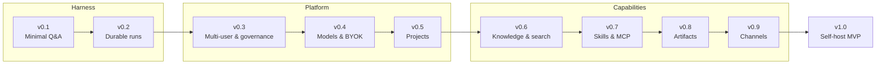

# llame Roadmap

Forward-looking plan toward a self-hostable MVP (**v1.0**) — the work that is **not yet done**. Rationale and detail for every milestone live in [SPEC.md](SPEC.md).

**Now:** a chat proof-of-concept (auth, model selection, persisted chats) running a LangGraph supervisor — being reduced to a clean single-model loop.
**Next:** v0.1, the smallest useful Q&A harness; features grow from there.

**Tracking:** execution lives in GitHub [milestones](https://github.com/leon0399/llame/milestones) and issues — each milestone links its tracking epic, and only the current milestone (v0.1) is decomposed into sub-issues.

## Guiding principles

1. **Smallest loop first** — start with the smallest single-loop harness; add tools, autonomy, governance, and multi-agent only when evals justify them.
2. **Durable state over prompt tricks** — todos, goals, memories, runs, artifacts, and tool calls are structured data, not hidden chat text.
3. **Policy before capability** — a tool/model/skill is available only if effective policy allows it; deny overrides allow.
4. **Config is inherited, resolved, and snapshotted** — every run stores the effective config it ran with.
5. **BYOK means user-owned** — the instance works with no provider configured; users supply their own.
6. **Wiki is memory** — personal/team knowledge is a continuously indexed source of truth, not a side upload.
7. **Every long-running operation is resumable** — clients are subscribers to an event log, not holders of fragile state.

## Release timeline

## v0.1 — Minimal Q&A harness

**Tracking:** [milestone v0.1](https://github.com/leon0399/llame/milestone/9) · epic #51

The smallest useful version: single-user, single-model **streaming** Q&A — no worker, no tools, no supervisor.

- Chat session/event model + cache-aware context builder (stable prompt prefix). (SPEC §9.4) — #53
- Minimal model integration: one provider, user-supplied key, behind a `ModelClient` interface. (SPEC §14) — #54
- Single-model streaming loop, replacing the `langgraph-supervisor` chat path. (SPEC §9) — #55
- Per-run budgets + cost/token/cache telemetry. (SPEC §29) — #56
- Conversation context compaction for long chats. — #57
- Minimal eval set: happy path, prompt injection, context overflow, budget. — #58

## v0.2 — Durable runs

**Tracking:** [milestone v0.2](https://github.com/leon0399/llame/milestone/1) · epic #36

The durability upgrade: every message becomes a worker-processed run with a refresh-safe event stream.

- pg-boss queue + scheduler on Postgres. (SPEC §24) — #47
- Durable run pipeline: API stores + enqueues; a worker appends to the run-event store. (SPEC §9) — #48
- Refresh-safe SSE run-event replay. (SPEC §9.4) — #49
- Move the single-model loop into the worker. (SPEC §9.5, §23.1) — #50

## v0.3 — Multi-user & governance

**Tracking:** [milestone v0.3](https://github.com/leon0399/llame/milestone/10) · epic #52

Added once multi-user, BYOK scoping, and tools make governance real — the schema keeps scope/ownership columns from the start so this is additive.

- Identity, nested org units & memberships, RBAC + deny policies. (SPEC §6–§7) — #44, #45
- Config resolver with per-run config snapshots. (SPEC §6.3–§6.4) — #46

## v0.4 — Models & BYOK

**Tracking:** [milestone v0.4](https://github.com/leon0399/llame/milestone/2) · epic #37

- Provider abstraction + encrypted, scoped credential vault; model router; cost/quota tracking. (SPEC §14)
- BYOK at user and instance scope — grows the v0.1 `ModelClient` into the full router.

## v0.5 — Projects & control primitives

**Tracking:** [milestone v0.5](https://github.com/leon0399/llame/milestone/3) · epic #38

- Projects: create, share, roles, and per-project config resolution. (SPEC §8)
- Goals & todos as durable objects; slash-command registry (`/goal`, `/todo`, `/model`, `/project`, …). (SPEC §10–§11)

## v0.6 — Knowledge & hybrid search

**Tracking:** [milestone v0.6](https://github.com/leon0399/llame/milestone/4) · epic #39

- Knowledge Spaces: local Markdown / Obsidian (read-only) and Notion (read-only). (SPEC §15)
- Ingest → chunk → embed; hybrid retrieval over pgvector + FTS with citations; chat / project / artifact search. (SPEC §16)

## v0.7 — Skills & MCP

**Tracking:** [milestone v0.7](https://github.com/leon0399/llame/milestone/5) · epic #40

- Skill registry using the single-`SKILL.md` format, with registry-assigned trust, install scopes, and audit logs. (SPEC §12)
- MCP host (stdio + HTTP) and a connector framework: GitHub, local filesystem (read-only), Notion (read-only). (SPEC §13)

## v0.8 — Artifacts

**Tracking:** [milestone v0.8](https://github.com/leon0399/llame/milestone/6) · epic #41

- Versioned Markdown/HTML artifacts with object storage; Docker sandbox for explicitly approved execution. (SPEC §17)

## v0.9 — Messaging channels

**Tracking:** [milestone v0.9](https://github.com/leon0399/llame/milestone/7) · epic #42

- One channel (Telegram or Discord) bridged onto the same run system, with explicit identity linking. (SPEC §19)

## v1.0 — Self-host MVP

**Tracking:** [milestone v1.0](https://github.com/leon0399/llame/milestone/8) · epic #43

- Docker Compose deployment, backup/restore, audit logs, secure defaults, and approval policies — meeting the acceptance criteria in SPEC §34.

## Future (post-1.0)

Agent teams / subagents (multi-agent returns here, behind evals), workflow builder, bidirectional wiki writes, enterprise SSO, additional channels & connectors, artifact app hosting, and a signed skill marketplace. (SPEC §32, §35)
