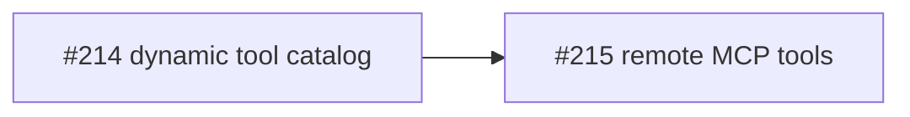
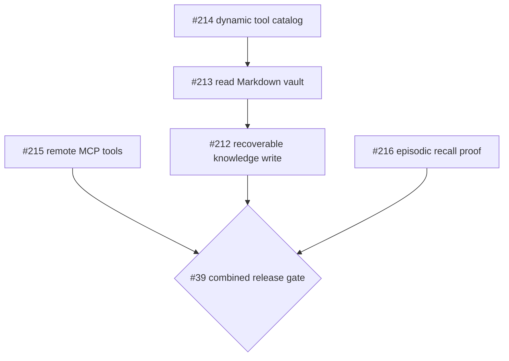

# llame roadmap

This file contains sequenced work that has not shipped. GitHub milestones and
issues own live status, scope, and implementation detail. Shipped work belongs in
[CHANGELOG.md](CHANGELOG.md); uncommitted directions belong in
[VISION.md](VISION.md).

No dates or effort estimates are implied.

## Now: v0.6 Remote MCP tools

Tracking: [milestone v0.6](https://github.com/leon0399/llame/milestone/4) and
[tracker #40](https://github.com/leon0399/llame/issues/40).

Outcome: an operator can configure an instance-managed remote Streamable HTTP MCP
server, and an ordinary Chat can use an explicitly enabled read-only tool through
the existing durable Run loop. Web search is the acceptance example, not a
hard-coded connector.

- [#214](https://github.com/leon0399/llame/issues/214) makes the existing Run loop
  consume native and dynamic tools through one catalog.
- [#215](https://github.com/leon0399/llame/issues/215) adds instance-managed remote
  MCP discovery and execution, plus browser and real-search acceptance.

This milestone excludes stdio, user-scoped setup, OAuth, management UI, MCP
resources/prompts, and remote write/send/delete tools.

## Next: v0.7 Runnable personal knowledge agent

Tracking: [milestone v0.7](https://github.com/leon0399/llame/milestone/5) and
[tracker #39](https://github.com/leon0399/llame/issues/39).

Outcome: the assistant can use remote research, read and update a personal
Git-backed Markdown vault, and deliberately recall a prior Chat. The components
do not count as a release until the combined product loop runs end to end.

- [#216](https://github.com/leon0399/llame/issues/216) proves safe recall across
  two Chats. It can proceed in parallel with the mainline.
- [#213](https://github.com/leon0399/llame/issues/213) adds bounded read-only search
  and reads over a personal Markdown/Git vault after #214.
- [#212](https://github.com/leon0399/llame/issues/212) lands one visible,
  recoverable agent-authored knowledge commit after #213.
- [#39](https://github.com/leon0399/llame/issues/39) owns the combined MCP to
  knowledge to later-recall exit gate.

This milestone excludes shared Knowledge Spaces, project routing, embeddings,
semantic facts, automatic prompt injection, Jujutsu workflows, full permission
control, and child-agent orchestration.

## Deferred backlog

Open work remains valid without being on the critical path:

- [#196](https://github.com/leon0399/llame/issues/196),
  [#197](https://github.com/leon0399/llame/issues/197), and
  [#198](https://github.com/leon0399/llame/issues/198) cover richer search and
  episodic-memory behavior beyond the v0.7 proof.
- [#91](https://github.com/leon0399/llame/issues/91),
  [#118](https://github.com/leon0399/llame/issues/118), and
  [#119](https://github.com/leon0399/llame/issues/119) cover remaining Run budget,
  event-delivery, and retention work.
- [#153](https://github.com/leon0399/llame/issues/153) owns progressive bounded
  compaction when no single available source model can fit portable history;
  current execution fails those cases explicitly instead of truncating.

Deferred means unsequenced, not closed.
