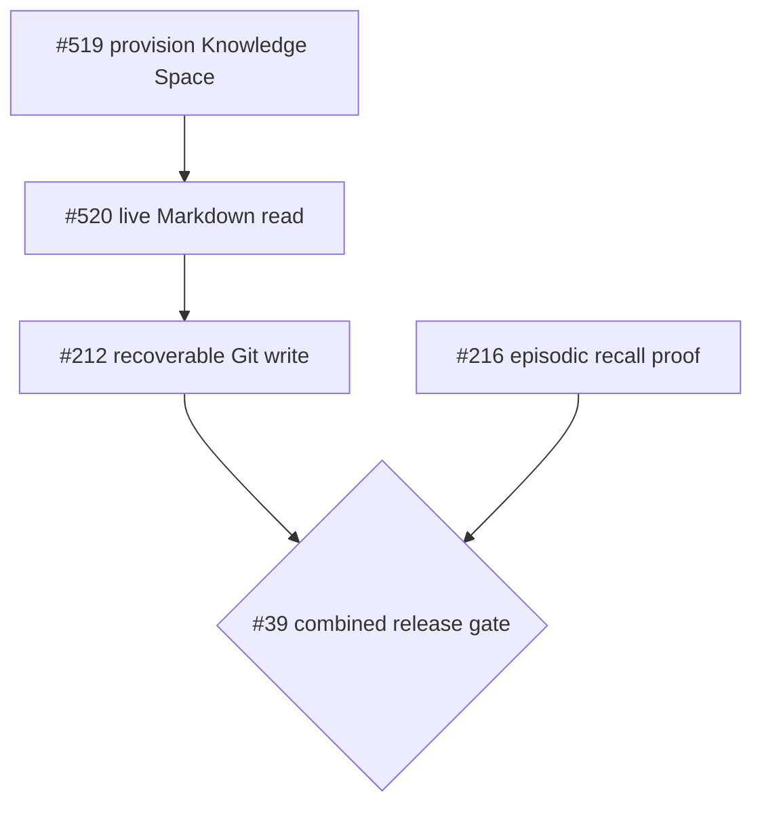

# llame roadmap

This file contains sequenced work that has not shipped. GitHub milestones and
issues own live status, scope, and implementation detail. Shipped work belongs in
[CHANGELOG.md](CHANGELOG.md); uncommitted directions belong in
[VISION.md](VISION.md).

No dates or effort estimates are implied.

## Immediate cut: file-native personal intelligence

Outcome: any authenticated owner can self-service one personal Markdown
Knowledge Space beneath an operator-configured root, and the existing hosted Run
loop gains bounded reads over its live files. A later layer adds recoverable Git
writes and then reuses that change path for inspectable file-backed Profile
context. The duplicated database personalization surface is retired only after
the file path has proven the replacement.

### 1. v0.7 Runnable personal knowledge agent

Tracking: [milestone v0.7](https://github.com/leon0399/llame/milestone/5) and
[tracker #39](https://github.com/leon0399/llame/issues/39).

Outcome: building on the shipped remote-MCP foundation, the assistant can use
remote research, read a live personal Markdown Knowledge Space, land a
recoverable Git-backed update, and deliberately recall a prior Chat. The
unshipped components do not count as a release until the combined product loop
runs end to end.

```mermaid
flowchart TD
    K0["#519 provision Knowledge Space"] --> K1["#520 live Markdown read"] --> K2["#212 recoverable Git write"]
    E0["#216 episodic recall proof"]
    Gate{"#39 combined release gate"}

    K2 --> Gate
    E0 --> Gate
```

- [#216](https://github.com/leon0399/llame/issues/216) proves safe recall across
  two Chats. It can proceed in parallel with the mainline.
- [#213](https://github.com/leon0399/llame/issues/213) tracks self-service
  provisioning ([#519](https://github.com/leon0399/llame/issues/519)) and bounded
  live Markdown search/read ([#520](https://github.com/leon0399/llame/issues/520)).
- [#212](https://github.com/leon0399/llame/issues/212) introduces the minimum Git
  substrate and lands one visible, recoverable agent-authored knowledge commit
  after #213.
- [#39](https://github.com/leon0399/llame/issues/39) owns the combined MCP to
  knowledge to later-recall exit gate. Its remote-MCP prerequisite is already
  shipped, so it is context for the gate rather than an open roadmap node.

This milestone excludes shared Knowledge Spaces, project routing, embeddings,
semantic facts, automatic prompt injection, Jujutsu workflows, full permission
control, and child-agent orchestration.

The owner-scoped filesystem boundary established by #213 and the bounded Git
change path added by #212 are the prerequisites for agent-readable and
agent-editable profile files. The profile cut does not assume that a personal
Sandbox or local Node already exists.

### 2. Git-backed Profile Space

- Support one default Profile Space containing `USER.md`, `SOUL.md`, and
  `AGENTS.md` at an exact Git revision.
- Let the user or an authorized agent edit those files through ordinary Git. No
  profile editor UI is required for this cut; agent changes use the bounded Git
  change path proven by the Knowledge Space.
- Bind the resource identity, commit OID, and rendered contributions into the
  Run's effective-context receipt.
- Keep activation, inference egress, tool and Workspace permission, linked-source
  ownership, and secrets outside model-editable files.
- Do not accept caller-selected host paths or create repositories on a user's
  machine automatically. A hosted source is linked explicitly; a future
  single-owner Node may use its trusted local configuration.
- Execute normally without profile context when no Profile Space is linked.

This slice needs a focused design and issue breakdown before implementation. It
does not require multiple Agent Profiles, a profile marketplace, inheritance, a
new permission language, Personal Realm synchronization, or a local inference
runtime.

### 3. Retire database-authored personalization

After Profile Space context has executed successfully and its receipt is
owner-visible:

- migrate or export `preferredName`, `about`, and `responsePreferences` into
  `USER.md` without silently widening their authority;
- stop accepting new database-authored personalization;
- remove the profile editor, field-specific API and prompt-template paths, and
  the personalization table after the migration boundary; and
- remove account-identity prompt injection rather than reproducing it in a
  profile file. Tools that need authenticated identity continue to resolve it
  server-side.

Conversation-history consent, linked-resource ownership, profile activation,
inference egress, and tool or Workspace authorization remain explicit
control-plane state. They are not personalization content and do not move into
Git-authored instruction files.

## Next: standalone personal Node and CLI

Ship a lightweight single-owner runtime and a first-party `llame` CLI using the
same Chat, Run, Profile Space, and Knowledge Space contracts. It operates without
an account and uses inference providers configured by the user. llame does not
bundle, download, update, or operate a local model runtime.

This stage excludes Personal Realm synchronization, remote Workspace dispatch,
external coding-harness adapters, and child-agent orchestration.

## Then: Personal Realm synchronization

Link one standalone Node to one personal upstream and synchronize portable
personal state bidirectionally. Git reconciles Profile and Knowledge Spaces; the
application protocol reconciles Chats, branches, messages, compactions, and
finalized receipts. Initial and later synchronization use the same event and Git
paths. Credentials, host paths, Workspace contents, queue rows, leases, and raw
runtime state remain local.

## After personal synchronization

1. Registered Workspaces, `EnterWorkspace`, derived worktrees, reproducible
   Sandboxes, sticky execution affinity, phone-visible remote control, and
   transparent `ask | wait | fallback | exit` recovery.
2. Android as a local-capable Chat and remote-steering surface, using a configured
   platform inference provider when available but no llame-bundled model.
3. Shared family, team, school, and organization Knowledge Spaces with explicit
   information-flow policy.
4. Live foreign-authority mounts and policy-controlled shared replication.
5. Multiple Agent Profiles, versioned Skills and agent-editable configuration,
   Apps and workflows, external harness adapters, and child-agent orchestration
   when each has an independently proven user job.

## Deferred backlog

Open work remains valid without being on the critical path:

- [#196](https://github.com/leon0399/llame/issues/196),
  [#197](https://github.com/leon0399/llame/issues/197), and
  [#198](https://github.com/leon0399/llame/issues/198) cover richer search and
  episodic-memory behavior beyond the v0.7 proof.
- [#91](https://github.com/leon0399/llame/issues/91),
  [#118](https://github.com/leon0399/llame/issues/118), and
  [#119](https://github.com/leon0399/llame/issues/119) cover remaining Run budget,
  event-delivery, and retention work.
- [#153](https://github.com/leon0399/llame/issues/153) owns progressive bounded
  compaction when no single available source model can fit portable history;
  current execution fails those cases explicitly instead of truncating.

Deferred means unsequenced, not closed.

The distributed execution and multi-authority designs remain retained north-star
direction. Deferral changes implementation order; it does not delete those
contracts or their decision provenance.
