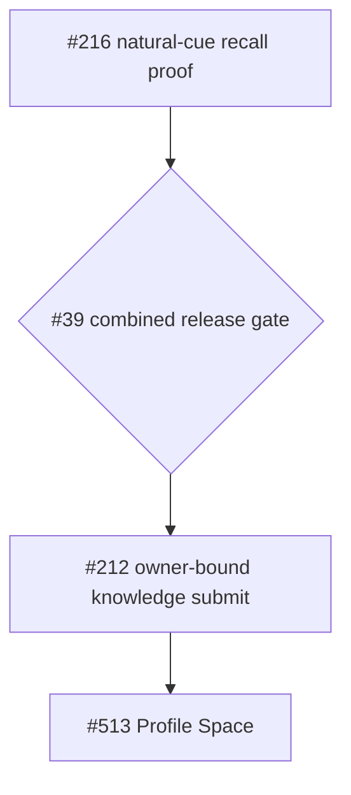

# llame roadmap

This file contains sequenced work that has not shipped. GitHub milestones and
issues own live status, scope, and implementation detail. Shipped work belongs in
[CHANGELOG.md](CHANGELOG.md); uncommitted directions belong in
[VISION.md](VISION.md).

The [delivery Project](https://github.com/users/leon0399/projects/2) owns the
ordered current queue, workflow stage, priority, and next action. Start with its
Current work view; the complete backlog and pull requests have separate views.
Native issue dependencies own hard prerequisites. The stage order below is a
selection policy, not an additional technical blocker between independent work.

No dates or effort estimates are implied.

## Current: personal subscription access through system models

Tracking: [#751](https://github.com/leon0399/llame/issues/751). Start with
[#752](https://github.com/leon0399/llame/issues/752): prove the personal operator's
subscription authentication through the existing system-configured model catalog
and a tool-capable Run. Deliver assessed paths through #753/#754. Per-user account
linking and general credential-management UI follow later. Reuse #18 only if the
selected credential contract requires it.

System-model visibility does not establish provider support for sharing personal
subscriptions among independent users. Preserve owner isolation, verify quota
and reconnect behavior, and record provider-specific limits. Cost savings remain
unproven until the selected personal-use path works.

## Next: basic personal agent capabilities

Tracking: [#762](https://github.com/leon0399/llame/issues/762). Select these
outcomes before Knowledge, recall improvements, and personalization:

- B1: [#763](https://github.com/leon0399/llame/issues/763) tools and permissions:
  audit shipped native/MCP execution; start with operator-configured system-wide
  allow/reject permissions only. These become defaults for later personal settings;
  define override limits separately from mandatory isolation and execution bounds.
- B6: [#778](https://github.com/leon0399/llame/issues/778) the `ask` tool and
  interactive permission approvals, blocked by #763. This slice owns pending
  requests, owner decisions, cancellation, and safe resumption.
- B4: [#771](https://github.com/leon0399/llame/issues/771) agentic Skills tracker:
  manually provisioned operator-global skills [#770](https://github.com/leon0399/llame/issues/770),
  then skills over MCP [#772](https://github.com/leon0399/llame/issues/772).
  Both use a bounded catalog and on-demand loading with inspectable sources and
  unchanged owner/Run permissions. Use Codex's skill experience and OpenClaw's
  global discovery shape for local packages; define the MCP discovery/read
  contract in its proposal. Personal and workspace catalogs remain later scope.
- B2: [#764](https://github.com/leon0399/llame/issues/764) sessions and owner forks:
  reuse Chat/Run control and complete #154's context and compaction fidelity.
- B5: [#769](https://github.com/leon0399/llame/issues/769) durable agentic todos:
  nested work and explicit Todo/In progress/Done/Blocked/Abandoned states, using
  OMP as prior art. Decide phase/task versus recursive nesting in the proposal;
  preserve Chat reopen, fork, and retry semantics. This is #38's first todo slice.
- B3: [#765](https://github.com/leon0399/llame/issues/765) bounded subagents:
  spawn, inspect, cancel, and collect results with inherited permissions and #91
  run limits. This requires B1 and B2's contracts.

Select B1, B6, B4, B2, B5, then B3; retain the existing capability reference codes.
Skill-root details and todo transition policy remain proposal decisions. Skills
and todos deliver value to a single agent before delegation.

Selection does not approve implementation or create a technical dependency on a
subscription provider. Full organizational policy #45, ACP #29, broader revision
topology #611, generic durable continuation #309, and Node/CLI #755 are not
assumed prerequisites of these bounded outcomes.

## Later: file-native personal intelligence

Remaining outcome: build on the shipped live multi-space, ranged-read, and
passage-search personal Knowledge foundation with recoverable Git writes, then
reuse that change path for inspectable file-backed Profile context. Retire the
duplicated database personalization surface only after the file path has proven
the replacement.

### Personal Knowledge agent

Tracking: [Personal Knowledge agent milestone](https://github.com/leon0399/llame/milestone/5) and
[tracker #39](https://github.com/leon0399/llame/issues/39).

Outcome: the assistant builds on the shipped remote-MCP, live Knowledge
retrieval, native `kb://` file writes, host bash, and deliberate prior-Chat
recall foundations to use remote research and land a recoverable Git-backed
update. The remaining component does not count as a release until the combined
product loop runs end to end.

```mermaid
flowchart TD
    E0["#216 natural-cue recall proof"]
    Gate{"#39 combined release gate"}
    K2["#212 owner-bound knowledge submit"]
    P0["#513 Profile Space"]

    E0 --> Gate
    Gate --> K2 --> P0
```

- [#216](https://github.com/leon0399/llame/issues/216) proves natural-cue recall
  invocation separately from correctness after invocation. It remains owned by
  [#194](https://github.com/leon0399/llame/issues/194).
- [#39](https://github.com/leon0399/llame/issues/39) owns the combined MCP to
  Knowledge commit to later-recall exit gate, blocked by #216 only. The
  recoverable commit in that proof uses the shipped native `kb://` `write` and
  `edit` tools plus allowlisted host `bash` Git on an operator-prepared
  repository; the bash attempt fence already prevents replayed commits. The
  underlying MCP, multi-space, retrieval, and write components have shipped;
  the combined product proof remains open.
- [#212](https://github.com/leon0399/llame/issues/212) is re-scoped to what
  host bash cannot provide: a trusted owner-to-space bound `knowledge_submit`
  with exact-path staging, Run provenance, and a `write_low_risk`
  classification. It no longer gates #39 and is sequenced as the first task of
  the Profile Space cut, whose exact-revision receipt is its first consumer.

This milestone excludes shared Knowledge Spaces, project routing, embeddings,
semantic facts, automatic prompt injection, Jujutsu workflows, full permission
control, and child-agent orchestration.

The owner-scoped filesystem boundary established by #213 and the owner-bound
submit re-scoped in #212 are the prerequisites for agent-readable and
agent-editable profile files. The profile cut does not assume that a personal
Sandbox or local Node already exists.

### Git-backed Profile Space

Tracking: [#513](https://github.com/leon0399/llame/issues/513), within
[#515](https://github.com/leon0399/llame/issues/515). Selected after #39's release
proof; the re-scoped #212 is its first task.

- Support one default Profile Space containing `USER.md`, `SOUL.md`, and
  `AGENTS.md` at an exact Git revision.
- Let the user or an authorized agent edit those files through ordinary Git. No
  profile editor UI is required for this cut; agent changes land through the
  owner-bound `knowledge_submit` from #212, never through host bash, because
  the receipt binds the exact revision and the change must carry Run
  provenance.
- Bind the resource identity, commit OID, and rendered contributions into the
  Run's effective-context receipt.
- Keep activation, inference egress, tool and Workspace permission, linked-source
  ownership, and secrets outside model-editable files.
- Do not accept caller-selected host paths or create repositories on a user's
  machine automatically. A hosted source is linked explicitly; a future
  single-owner Node may use its trusted local configuration.
- Execute normally without profile context when no Profile Space is linked.

This slice needs an approved focused design before implementation. It
does not require multiple Agent Profiles, a profile marketplace, inheritance, a
new permission language, Personal Realm synchronization, or a local inference
runtime.

### Retire database-authored personalization

Tracking: [#514](https://github.com/leon0399/llame/issues/514), blocked by #513.

After Profile Space context has executed successfully and its receipt is
owner-visible:

- migrate or export `preferredName`, `about`, and `responsePreferences` into
  `USER.md` without silently widening their authority;
- stop accepting new database-authored personalization;
- remove the profile editor, field-specific API and prompt-template paths, and
  the personalization table after the migration boundary; and
- remove account-identity prompt injection rather than reproducing it in a
  profile file. Tools that need authenticated identity continue to resolve it
  server-side.

Conversation-history consent, linked-resource ownership, profile activation,
inference egress, and tool or Workspace authorization remain explicit
control-plane state. They are not personalization content and do not move into
Git-authored instruction files.

## Backlog: standalone personal Node and CLI

Tracking: [#755](https://github.com/leon0399/llame/issues/755). Retained in the
backlog; design and implementation work are not currently selected. Open
experimental PRs #673 and #675-#684, plus older drafts #538/#539, may contain
reusable code to assess during future implementation against the approved design.

Ship a lightweight single-owner runtime and a first-party `llame` CLI using the
same Chat, Run, Profile Space, and Knowledge Space contracts. It operates without
an account and uses inference providers configured by the user. llame does not
bundle, download, update, or operate a local model runtime.

When the user explicitly starts the CLI inside a directory, only that directory
is advertised and the local harness may grant native execution there. The grant
is bound to trusted CLI placement provenance, remains sticky for follow-up Runs,
does not authorize later model-selected directories, and is disclosed honestly as
host-user authority rather than filesystem confinement.

This stage excludes a daemon Workspace registry, model-directed entry into other
directories, Personal Realm synchronization, remote Workspace dispatch, external
coding-harness adapters, and child-agent orchestration.

## Then: local Sandbox execution

Tracking: [#756](https://github.com/leon0399/llame/issues/756), after the Node
runtime. Legacy artifacts tracker #41 retains artifact ownership.

Add an explicit local Sandbox mode before accepting remote Workspace placement:

1. run an approved current-directory or derived-worktree view in one fixed managed
   environment;
2. reuse Sandbox instances and non-secret dependency caches across follow-up Runs;
3. keep the original checkout available for ordinary host-side work; and
4. let an authorized agent propose Git-backed environment changes that the Node
   validates, builds, and activates only as a later accepted revision.

The shipped [bash-execution](openspec/specs/bash-execution/spec.md) contract is
the adapter seam: the same live host filesystem as native file tools, bounded
results, attempt receipts, and unknown-outcome fencing. Alpha host bash is
already available under
the native `tools.nativeExecutorId` gate when allowlisted. A follow-up managed
Sandbox proposal strengthens secret boundary, process isolation, and workspace
mount without changing the command/result contract. A separate permission
proposal owns approval/RBAC; bash must not invent permission modes.

Native execution remains an explicit policy option. Sandbox failure never falls
back to native execution without a new authorization decision. Exact Nix,
container, process-confinement, or VM realization remains capability design.

## Then: Personal Realm synchronization

Tracking: [#757](https://github.com/leon0399/llame/issues/757), requiring Node
operation, portable Knowledge identity #547, and the retention/deletion
semantics in #666. Sandbox precedes it in the selected roadmap; that order is not a claim
that synchronization itself needs a Sandbox.

Link one standalone Node to one personal upstream and synchronize portable
personal state bidirectionally. Git reconciles Profile and Knowledge Spaces; the
application protocol reconciles Chats, branches, messages, compactions, and
finalized receipts. Initial and later synchronization use the same event and Git
paths. Credentials, host paths, Workspace contents, queue rows, leases, and raw
runtime state remain local.

## After personal synchronization

1. [#758](https://github.com/leon0399/llame/issues/758): registered Workspaces, `EnterWorkspace`, sandbox-by-default model-inferred and
   remote entry, sticky execution affinity, phone-visible remote control, and
   transparent `ask | wait | fallback | exit` recovery. Native placement remains
   available only through explicit policy and is never a silent fallback.
2. [#759](https://github.com/leon0399/llame/issues/759): Android as a local-capable Chat and remote-steering surface, using a configured
   platform inference provider when available but no llame-bundled model.
3. [#760](https://github.com/leon0399/llame/issues/760): shared family, team, school, and organization Knowledge Spaces with explicit
   information-flow policy.
4. [#761](https://github.com/leon0399/llame/issues/761): live foreign-authority mounts and policy-controlled shared replication.
5. Multiple Agent Profiles, versioned skill distribution, per-owner/workspace
   skill catalogs, and agent-editable configuration,
   Apps and workflows, external harness adapters, and child-agent orchestration
   when each has an independently proven user job.

## Deferred backlog

Open work remains valid without being on the critical path:

- [#91](https://github.com/leon0399/llame/issues/91),
  [#118](https://github.com/leon0399/llame/issues/118), and
  [#119](https://github.com/leon0399/llame/issues/119) cover remaining Run budget,
  event-delivery, and retention work.
- [#153](https://github.com/leon0399/llame/issues/153) owns progressive bounded
  compaction when no single available source model can fit portable history;
  current execution fails those cases explicitly instead of truncating.

Deferred means unsequenced, not closed.

The distributed execution and multi-authority designs remain retained north-star
direction. Deferral changes implementation order; it does not delete those
contracts or their decision provenance.
