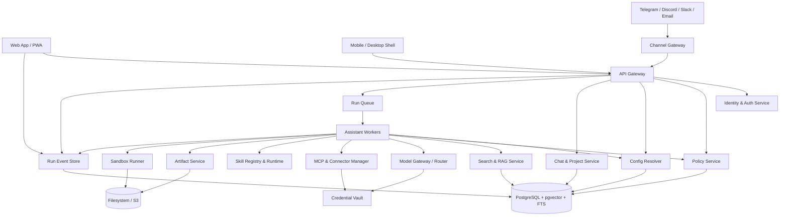
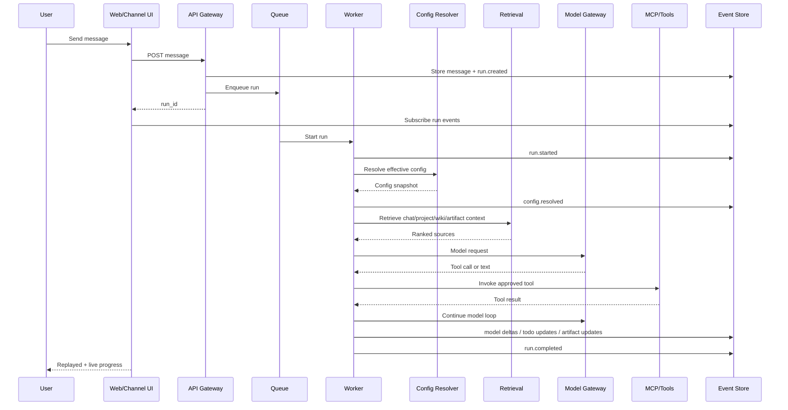
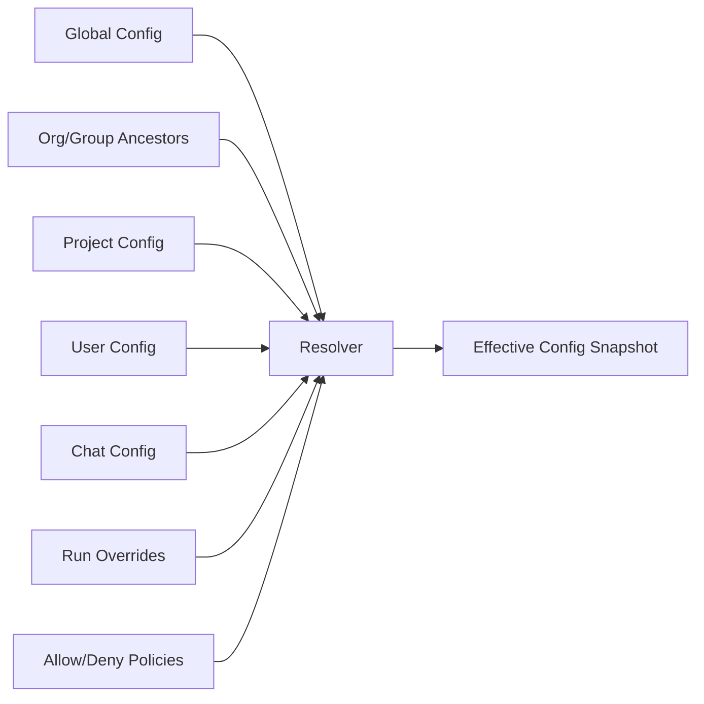
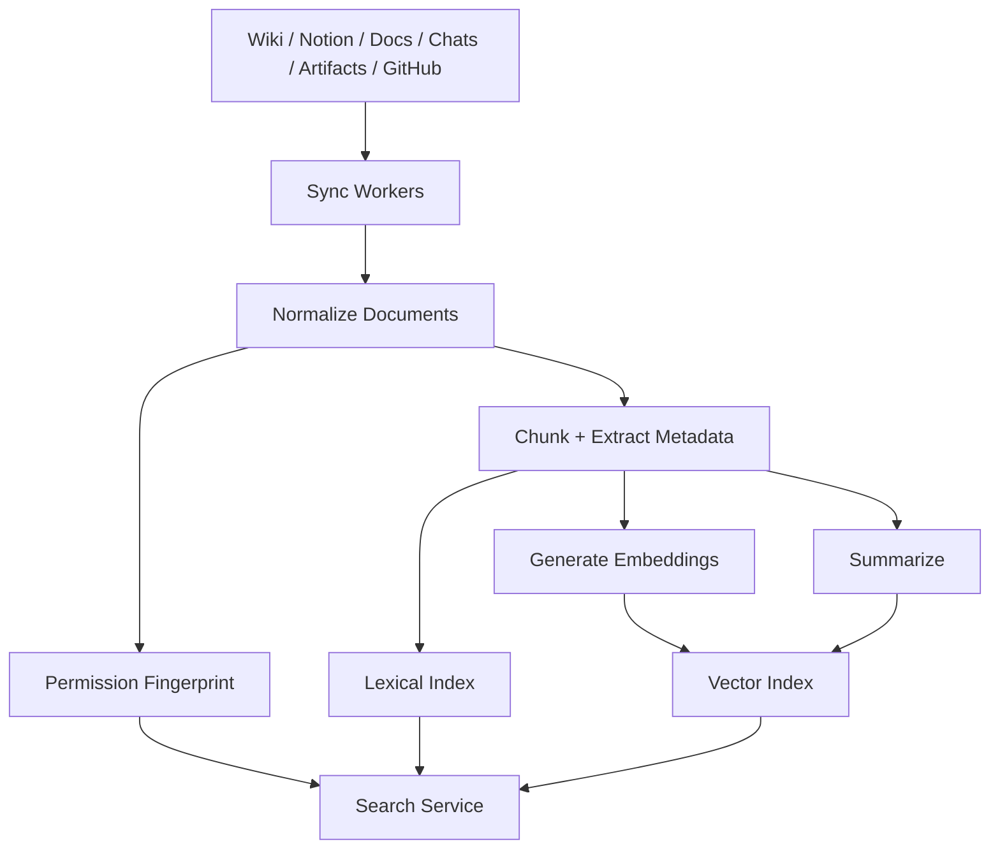
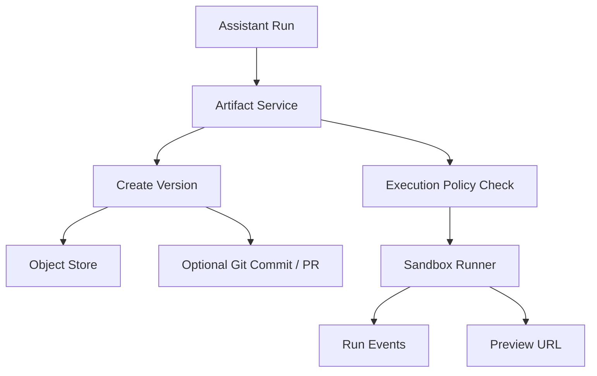

# Self-Hosted Multi-User Personal AI Assistant — Feature Specification

**Status:** Refined v0.3  
**Generated:** 2026-06-28  
**Audience:** Product, engineering, architecture, security, and platform teams  
**Primary objective:** Define a next-generation, self-hosted AI assistant platform that combines multi-user governance, personal knowledge systems, project workspaces, durable agent execution, rich artifacts, BYOK model access, MCP/connectors, skills, slash commands, and third-party messaging channels.

> **Refinement notes (v0.2 — 2026-06-28):** This revision (a) eliminates the `skill.yaml` / `SKILL.md` duplication in favor of the single-`SKILL.md` Agent Skills standard, (b) narrows the technical stack to one coherent TypeScript stack matching the existing `llame` monorepo, (c) separates author-declared skill capabilities from platform-assigned trust, (d) collapses the provider / search / vector / sandbox option menus to one MVP default plus one documented scale swap, and (e) adopts a **Postgres-first** posture (§24.0) — queue, scheduler, cache, locks, sessions, vectors, and full-text all live in one PostgreSQL, removing Redis, BullMQ, and the separate scheduler service from MVP (object storage stays a filesystem volume by default). **Assumption:** the platform is built on the existing Next.js / NestJS / TypeScript monorepo, not greenfield — if that is wrong, §23 inverts. Design opinions beyond the two refinement asks are parked under §33.1 ("Further suggestions"), not applied silently.

---

## 1. Executive Summary

This product is a **self-hosted, multi-user AI operating layer** rather than a simple chat UI. It should support individuals, families, small organizations, and enterprise teams from the same core architecture. The assistant must treat **groups, projects, goals, todos, skills, commands, connectors, model credentials, memories, artifacts, and knowledge bases** as first-class durable entities.

The most important architectural decision is to keep the system **multi-tenant-ready from day one**. "From day one" applies to the **data model, not the build order**: every resource carries explicit ownership and scope columns so multi-tenancy is never blocked — but the governance _engine_ (RBAC, deny-overrides-allow resolution, the config resolver) is built when multi-user, BYOK scoping, and tools make it real (roadmap v0.3), not in the first single-user release. This follows the "smallest single-loop harness first" principle: the schema anticipates global defaults, nested group/project configuration, user-owned credentials, per-chat overrides, per-run snapshots, and policy resolution, while the first shippable version (v0.1) is a minimal single-user Q&A loop.

The second major decision is to make every assistant response a **durable worker run**. The web request should not do the work directly. A user message should create a message record, enqueue a run, stream progress events, persist intermediate todo/artifact/tool state, and allow the UI or messaging channel to reconnect after refresh without losing progress.

The third major decision is to make the assistant **wiki-centric**. Chat is the interface, but a user's or organization's knowledge base should be the long-term memory substrate. Obsidian-like local Markdown vaults, Notion workspaces, Logseq-like graphs, local folders, Git repositories, document stores, and future enterprise knowledge systems should be normalized through a common **Knowledge Space** abstraction.

The fourth major decision is to support **interactive artifacts as executable, shareable, versioned work products**. Claude-style artifacts are a useful baseline, but this product should extend them with project association, GitHub linkage, sandbox execution, versioning, export formats, public/private sharing, provenance, and optional cloud/local runners.

---

## 2. Research Baseline and Product Lessons

### 2.1 Current systems and lessons

**OpenClaw-inspired personal agents.** Current public descriptions of OpenClaw position it as a self-hosted/local autonomous assistant accessed mainly through messaging channels, with local history, external LLMs, skills, and real-world actions through tools and integrations. The strongest product lessons are: messaging-first agents feel natural; skills unlock extensibility; local deployment is attractive; but broad device, file, browser, shell, and credential access creates major security risks if not governed by policy, sandboxing, and approvals. Public reporting and research around OpenClaw-style skill ecosystems show why untrusted skills must be signed, scanned, capability-declared, sandboxed, and auditable. See source notes [S13], [S14], [S15], [S23].

**Claude Code.** Claude Code's current docs expose useful primitives: slash commands, skills loaded lazily from `SKILL.md`, nested/project/personal/enterprise skill locations, hooks, subagents, MCP, background tasks, worktrees, and shareable artifacts. Important lessons: commands should be first-class; skills should be packaged and lazily loaded; long-running tasks need visible state; artifacts should be versioned and shareable; permission rules and organization controls matter. See [S2], [S3], [S16].

**OpenAI Codex.** Codex docs show a modern coding-agent surface spanning CLI, app, IDE, web, GitHub/Slack/Linear integrations, MCP, permissions, hooks, AGENTS.md, sandboxing, workflows, skills, subagents, and app-server style session continuity. Important lessons: one agent backend should support multiple clients; local and remote execution modes should share the same session model; command-driven workflows are valuable for power users; sandboxes and approvals are mandatory for write/execute operations. See [S5], [S6].

**MCP.** MCP is now a central integration standard for connecting AI apps to external data, tools, prompts, and workflows. Its model of hosts, clients, servers, tools, resources, prompts, capability negotiation, progress, cancellation, and security/consent principles should be adopted directly. This product should be an MCP host and also expose selected project/assistant capabilities as MCP servers where useful. See [S1], [S17].

**Open WebUI.** Open WebUI provides a strong self-hosted model-agnostic baseline: Ollama and OpenAI-compatible providers, Docker deployment, plugins, tool calling, RAG, terminal/computer integrations, knowledge sync, and MCP-to-OpenAPI proxy tooling. Lessons: provider-agnostic architecture, local/offline operation, and Docker-first setup are table stakes. See [S7].

**LibreChat.** LibreChat is a self-hosted chat platform with MCP, agents, code interpreter, artifacts, custom endpoints, Docker, and flexible configuration. Lessons: compatibility with multiple provider APIs and the familiar ChatGPT-like UI lowers adoption friction; adding MCP and artifacts to chat UIs is increasingly expected. See [S8].

**AnythingLLM.** AnythingLLM emphasizes workspaces, multiple vector database backends, model routers, agents, custom skills, scheduled jobs, RAG, document agents, Gmail/Calendar/Outlook agents, Telegram channel support, and self-hosted/desktop/cloud options. Lessons: workspaces map well to projects/groups; model routing and vector backend abstraction should be first-class; scheduled jobs and channel integrations are valuable beyond chat. See [S9].

**Dify.** Dify's self-hosted Docker Compose deployment includes separate API, worker, worker beat, web, plugin daemon, vector DB, PostgreSQL, Redis, nginx, SSRF proxy, and sandbox containers. Dify's Knowledge model also provides a useful RAG baseline with knowledge bases, retrieval testing, metadata filtering, embedding configuration, and external knowledge sources. Lessons: split API and worker early; include plugin isolation; include sandbox and SSRF controls in the default deployment; make RAG testable, inspectable, and tunable. See [S10], [S11].

**LobeHub.** LobeHub's current docs emphasize agents as units of work, agent groups, projects, workspaces, personal memory, command menu, artifacts, messaging channels, many model providers, and MCP-compatible skills. Lessons: users increasingly expect agent teams, project/resource libraries, memory transparency, and model/provider freedom. See [S12].

**Khoj.** Khoj is a useful reference for a personal AI "second brain": it can chat over user files, search notes/documents using natural language, understand Markdown/PDF/plaintext/org-mode/Notion, integrate with Obsidian and Emacs, and self-host on consumer hardware. Lessons: a personal assistant should treat personal notes and documents as the core knowledge base, not as optional uploads. See [S18].

**Hermes Agent and agent persistence lessons.** Hermes Agent (Nous Research) and OpenClaw [S13] are single-user, local-first agents whose storage choices are instructive precisely because llame inverts them (multi-user, server, Postgres). Both right-size to SQLite (ACID, portability, rich queries, no ops burden) — the single-user analogue of our Postgres-first bet — and both keep append-only conversation transcripts plus a session id for resume (validating the run/chat event store) while separating raw episodic transcripts from curated semantic memory and procedural skills (validating the §20 memory layering). The cautionary lessons: (1) **unbounded growth** — Hermes documents that its event store accumulates forever and is being retrofitted with 30-day cleanup, so retention/partitioning must be designed into the event tables from the start; (2) **files as source of truth** — OpenClaw's Markdown-first model is excellent for one local user but disqualifying for a multi-user server (no concurrency, cross-user queries, or transactional integrity), so llame keeps the database as the system of record and treats Markdown vaults as imported Knowledge Spaces; (3) **derived indexes must be rebuildable** — OpenClaw's SQLite index tracks content hashes to skip re-indexing and regenerates from the files, so llame's embeddings/FTS are derived from the event log, never authoritative; (4) **compaction as lineage** — Hermes links compacted sessions parent/child so history stays auditable and rewindable; (5) **scan-on-write + dedup** for agent-written memory to blunt prompt-injection and exfiltration. See [S26], [S27].

**Notion.** Notion's API model distinguishes internal connections, OAuth public connections, and personal access tokens, each with different permission and content-access semantics. Lessons: connector credentials must support team-owned automation credentials, OAuth app installs, and user-owned tokens; content access must be explicit and inspectable. See [S19], [S20].

**n8n.** n8n is not primarily a chat assistant, but it is a strong reference for workflow execution, credentials, projects, sharing, user access, RBAC, SAML/OIDC, executions, and debugging. Lessons: agentic automation should borrow workflow-platform governance, not just chatbot UX. See [S21].

### 2.2 Unverified named systems

The names **Hercules** and **Odysseus** were searched as current/public personal AI assistants or agent platforms, but reliable public technical docs were not found under those exact names during this pass. They should be treated as **unverified placeholders** until specific repositories, docs, or vendor pages are provided. Do not infer architecture or capabilities for them without source material.

---

## 3. Product Goals

The product must enable:

1. **Self-hosted deployment** through Docker Compose with sane defaults, health checks, migrations, backups, and safe upgrades.
2. **Multi-user operation from the ground up** for individuals, households, teams, organizations, and enterprises.
3. **Nested groups** such as `enterprise -> product -> team`, with inherited settings, policies, connectors, skills, and RAG sources.
4. **Project-centric collaboration** with shareable workspaces, per-project connectors, MCP servers, knowledge sources, artifacts, GitHub repositories, sandboxes, and roles.
5. **Personal wiki-centric knowledge** via a provider-neutral abstraction for Obsidian, Notion, Logseq, local folders, Git repos, and future systems.
6. **Integrated chat/project/wiki/artifact search** using metadata, summaries, full text, embeddings, graph links, and optional reranking.
7. **Durable async runs** where every user message is processed by a worker, not by the HTTP request thread.
8. **Refresh-safe progress** where the UI can reconnect to an event stream and restore the current run state.
9. **Claude-style artifacts on steroids** with interactivity, versioning, execution, GitHub linkage, sharing, and sandboxing.
10. **BYOK and OAuth credentials** for LLM providers and external services, with no requirement for an instance-wide model provider.
11. **MCP-first integrations** with per-scope capability governance.
12. **Third-party messaging interfaces** such as Telegram, Discord, Slack, Matrix, Signal/WhatsApp where feasible, and email.
13. **Slash commands, goals, todos, and skills** as durable agent-control primitives.
14. **Transparent memory and auditability** so users can inspect what the assistant knows, why it did something, and which tools/data were used.
15. **Extensible microservice-ready architecture** that starts simple but can split cleanly as usage grows.

---

## 4. Non-Goals

The MVP should not try to:

- Train a proprietary foundation model.
- Build a public marketplace for untrusted executable skills before the security model is mature.
- Offer arbitrary unaudited shell access from chat.
- Implement every third-party connector directly; MCP and connector adapters should cover most integrations.
- Become a full replacement for GitHub, Notion, Obsidian, Slack, Google Drive, or n8n.
- Support enterprise compliance certifications on day one, though the data model should not block them.
- Support distributed multi-region active-active operation in the first release.

---

## 5. Core Product Principles

**Durable state over transient prompt tricks.** Todos, goals, memories, summaries, artifacts, project configs, skills, command invocations, tool calls, and approvals must be stored as structured data, not just hidden in chat text.

**Policy before capability.** A connector, MCP tool, skill, model, or sandbox capability must not be available merely because it is installed. It must be allowed by effective policy for the current user, group, project, chat, and run.

**Deny overrides allow.** When global or parent-group policy denies an action, lower scopes cannot re-enable it.

**Config is inherited, resolved, and snapshotted.** Every run should store the effective configuration snapshot used to execute it. This supports debugging, auditing, and reproducibility.

**BYOK means truly user-owned.** The instance should work even when the admin configures no LLM provider. Users, groups, or projects can supply credentials if policy allows.

**Wiki is memory, not a side upload.** Personal and group knowledge systems should become continuously indexed knowledge spaces with graph links, permissions, summaries, and retrieval.

**Artifacts are work products.** Artifacts should be versioned, linked to chats/projects/runs, searchable, exportable, shareable, and optionally executable.

**Every long-running operation is resumable.** The frontend and messaging channels must be clients of an event log, not holders of fragile in-memory state.

---

## 6. Core Domain Model

### 6.1 Ownership hierarchy

```text
Instance
└── Root organization / household
    └── Nested group
        └── Nested subgroup
            └── Project
                └── Chat
                    └── Message
                        └── Run
```

A real enterprise example:

```text
Acme Corp
└── Product
    └── Platform
        └── AI Infrastructure
            └── Project: Internal AI Assistant
                └── Chat: RAG Indexing Architecture
```

A family example:

```text
Smith Household
└── Parents
└── Kids
└── Shared Home Projects
    └── Project: Summer Trip Planning
```

### 6.2 Scope types

The platform should support these scopes:

```text
global
org_unit
group
project
user
chat
message
run
artifact
knowledge_space
connector
skill
command
```

A setting may exist at multiple scopes. The effective value is computed by the Config Resolver.

### 6.3 Config inheritance order

```text
global defaults
→ root org settings
→ parent group settings, in path order
→ current group settings
→ project settings
→ user settings
→ chat settings
→ command/message/run overrides
→ policy removal of denied capabilities
```

For array-like settings such as enabled MCP servers, the merge strategy must be explicit:

```yaml
merge_strategy:
  providers: override_by_id
  mcp_servers: additive_with_deny
  skills: additive_with_deny
  rag_sources: additive_with_deny
  commands: additive_with_override
  model_policy: most_restrictive
  network_policy: most_restrictive
```

### 6.4 Effective configuration snapshot

Every run must store:

```text
run_config_snapshot
- run_id
- user_id
- group_path
- project_id
- chat_id
- selected_model
- available_models
- provider_credential_refs
- enabled_connectors
- enabled_mcp_servers
- enabled_skills
- enabled_commands
- rag_sources
- artifact_policy
- sandbox_policy
- network_policy
- approval_policy
- retention_policy
- computed_at
- config_version_ids
- policy_version_ids
```

This snapshot is essential for auditing questions like "Why was this tool available?" or "Which knowledge sources were used?"

---

## 7. Identity, Groups, Roles, and Policies

### 7.1 Users

Users can be local accounts, SSO accounts, OAuth-linked accounts, or invited guests.

Required features:

- Local login for self-hosted setups.
- Optional OIDC/SAML for organizations.
- Multiple linked external identities per user.
- User-owned provider credentials.
- User-owned personal wiki sources.
- User-visible memory and profile settings.
- Per-user model preferences where policy permits.
- User data export.

### 7.2 Nested org units

`org_units` represent organizations, families, divisions, teams, departments, or arbitrary groups.

Required features:

- Arbitrary parent-child nesting.
- Path materialization for fast permission checks.
- Settings at each node.
- Memberships at any node.
- Inherited memberships and explicit local memberships.
- Owners/admins at each node.
- Group-scoped connectors, skills, RAG sources, model policies, budgets, retention, and audit settings.

### 7.3 Roles

MVP roles:

```text
owner
admin
maintainer
member
viewer
guest
service_account
```

Role examples:

- **Owner:** can manage billing/license, root settings, all policies, and destructive operations.
- **Admin:** can manage groups, users, connectors, skills, and projects within scope.
- **Maintainer:** can configure project resources and project-specific connectors.
- **Member:** can use projects/chats and create artifacts subject to policy.
- **Viewer:** can read shared chats/artifacts but cannot run tools.
- **Guest:** limited project-specific collaborator.
- **Service account:** used by connectors and automations, never interactive by default.

### 7.4 Policy model

Use a combined RBAC/ABAC model:

```yaml
effect: allow | deny
action: "connector.invoke" | "artifact.publish" | "sandbox.execute" | "model.use"
resource_type: "mcp_server" | "provider" | "skill" | "artifact" | "project"
resource_id: optional
conditions:
  project_id: optional
  user_role_in_project: optional
  network_zone: optional
  max_cost_usd: optional
  requires_approval: true
```

Rules:

- Denies override allows.
- More specific policies override less specific policies only when they do not conflict with deny.
- Policies are versioned.
- Policy decisions are logged.
- High-risk actions require explicit approval even if generally allowed.

### 7.5 Approval policies

Actions requiring approvals may include:

- Shell execution.
- Browser/computer-use automation.
- Sending emails/messages.
- Mutating calendars.
- Writing to Notion/Obsidian/GitHub.
- Accessing sensitive files.
- Publishing artifacts externally.
- Using expensive models above budget.
- Invoking untrusted skills.
- Calling MCP tools marked destructive.
- Exfiltrating retrieved data to a remote provider.

Approval types:

```text
never_allowed
always_ask
ask_once_per_run
ask_once_per_chat
ask_once_per_project
auto_allow_readonly
auto_allow_low_risk
admin_only
```

---

## 8. Projects

### 8.1 Project concept

A **Project** is a shared workspace that contains:

- Chats.
- Goals and todos.
- Artifacts.
- Project documents.
- Knowledge sources.
- GitHub repositories.
- MCP servers.
- Skills and slash commands.
- Project memory.
- Members and roles.
- Secrets and credentials.
- Sandboxes.
- Run history.
- Audit events.
- Search indexes.

Projects can be private to a user, shared with a group, or shared with explicit users.

### 8.2 Project types

MVP should support:

```text
personal
shared
team
organization
public_readonly
template
archived
```

### 8.3 Project configuration

Example:

```yaml
project:
  name: "Internal AI Assistant"
  default_model: "user-preferred"
  allowed_model_classes:
    - fast
    - reasoning
    - local
  rag:
    enabled_sources:
      - project_docs
      - linked_chats
      - linked_wiki_spaces
      - github_repo_docs
    retrieval_profile: "balanced"
  connectors:
    github:
      enabled: true
      credential_policy: "project_or_user"
    notion:
      enabled: true
      mode: "read_only"
  mcp_servers:
    - github
    - filesystem_project_readonly
    - postgres_readonly
  skills:
    - spec-writer
    - pr-reviewer
    - release-notes
  artifacts:
    allow_interactive: true
    allow_public_share: false
    allow_sandbox_execution: true
  sandbox:
    runner: docker
    network: restricted
    max_cpu: 2
    max_memory_mb: 2048
    max_duration_seconds: 600
```

### 8.4 Project sharing

Capabilities:

- Invite users.
- Share with nested group.
- Public read-only artifact/chats if enabled.
- Per-project guest access.
- Project templates.
- Fork project with optional knowledge/artifact copy.
- Export project bundle.

### 8.5 Project lifecycle

```text
draft
active
paused
archived
deleted_pending_retention
purged
```

Archive should freeze new runs but preserve search and artifacts.

---

## 9. Chats, Messages, Runs, and Resumable Progress

### 9.1 Chat model

A chat belongs to a user or project and may be shared. It has:

- Title.
- Participants.
- Project linkage.
- Active goal.
- Chat summary.
- Linked knowledge sources.
- Linked artifacts.
- Linked todos.
- Retrieval profile.
- Model/provider preference.
- Privacy/retention policy.

### 9.2 Message model

Messages include:

```text
message_id
chat_id
sender_type: user | assistant | system | tool | channel | automation
sender_id
content_blocks
attachments
command_invocation_id
created_at
edited_at
deleted_at
visibility
```

Content blocks should support:

```text
text
markdown
image
audio
file
artifact_reference
todo_reference
tool_call_summary
approval_request
citation
code
structured_json
```

### 9.3 Run model

Each user message creates a run unless it is a purely local UI action. Runs are processed by workers.

Run statuses:

```text
queued
resolving_config
retrieving_context
planning
waiting_for_approval
running_model
running_tool
running_sandbox
updating_artifact
summarizing
completed
failed
cancelled
expired
```

### 9.4 Run event stream

A run event stream should be append-only and replayable:

```text
run_events
- run_id
- sequence
- event_type
- payload_json
- created_at
```

The event log is the durable source of truth and grows unbounded; design it **partition-friendly by `created_at`** so cold partitions can be archived (e.g. to object storage) instead of retrofitting cleanup later — the failure mode every local-first agent eventually hits ([S26]). Derived indexes (embeddings, FTS) are rebuildable from this log and are never authoritative ([S27]).

Event types:

```text
run.created
run.started
config.resolved
retrieval.started
retrieval.hit
retrieval.completed
model.requested
model.delta
model.completed
tool.requested
tool.approval_required
tool.started
tool.stdout
tool.stderr
tool.completed
todo.created
todo.updated
artifact.created
artifact.updated
artifact.version_published
sandbox.started
sandbox.completed
summary.updated
run.completed
run.failed
```

The UI subscribes by cursor:

```http
GET /api/runs/{run_id}/events?after_sequence=123
Accept: text/event-stream
```

If the page refreshes, it reads the latest run state and resumes from the last event sequence.

### 9.5 Worker isolation

The API thread must only:

1. Validate the request.
2. Store the message.
3. Create the run.
4. Enqueue the run.
5. Return the run ID.

Workers perform:

- Config resolution.
- Retrieval.
- Prompt/context assembly.
- Model calls.
- Tool loops.
- Todo updates.
- Artifact generation.
- Summarization.
- Index updates.
- Final message creation.

### 9.6 Queue requirements

MVP uses **pg-boss on PostgreSQL** — `SELECT … FOR UPDATE SKIP LOCKED` for atomic dequeue, built-in scheduling, retries with backoff, and archiving (it can optionally use `LISTEN/NOTIFY` to lower wake-up latency; tuning is deferred to implementation). No Redis, no broker, no separate scheduler service; the queue lives in the same Postgres as everything else (§24.0). It sits behind an interface so it can be swapped for **Redis + BullMQ** (very high job throughput) or **Temporal** (durable long-horizon workflows) per §23.4 — only when a measured limit forces it.

Required queue features:

- At-least-once processing.
- Idempotency keys.
- Retry with exponential backoff.
- Dead-letter queue.
- Per-user/project concurrency limits.
- Priority lanes.
- Cancellation.
- Run timeout.
- Worker heartbeat.

---

## 10. Goals and ToDo Items

### 10.1 Goals

A **goal** is a durable objective for a chat or project.

```text
goals
- id
- scope_type: chat | project
- scope_id
- title
- description
- status: active | paused | completed | cancelled
- created_from_message_id
- active_run_id
- linked_todo_ids
- linked_artifact_ids
- created_by
- created_at
- updated_at
```

The `/goal` command should create or update the active goal. It can optionally generate initial todos.

Example:

```text
/goal Write the self-hosted AI assistant specification and turn it into a Markdown artifact.
```

Expected behavior:

1. Store the goal.
2. Generate or update todos.
3. Update chat/project summary.
4. Start or modify the current run.
5. Show the active goal in the chat header.

### 10.2 Todo items

Todos are durable work-state objects, not prompt-only checklists.

```text
todo_items
- id
- scope_type: chat | project | user | group
- scope_id
- title
- description
- status: todo | in_progress | blocked | done | cancelled
- priority
- owner_type: user | assistant | agent | group
- assignee_user_id
- source_message_id
- parent_todo_id
- dependency_ids
- acceptance_criteria
- linked_artifact_ids
- linked_run_ids
- linked_github_issue_id
- created_by
- updated_by
- created_at
- updated_at
```

Todo events:

```text
todo_events
- todo_id
- event_type: created | updated | started | blocked | completed | reopened | linked_artifact | linked_commit
- actor_type
- actor_id
- message_id
- run_id
- payload_json
- created_at
```

### 10.3 Todo UX

The chat view should show:

- Active goal.
- Current run progress.
- Todo board or compact todo list.
- Which todo the assistant is working on.
- Blocked items and reasons.
- Linked artifacts and source messages.

The assistant can update todos during long work, but user-visible changes should be stored and reviewable.

---

## 11. Slash Commands

### 11.1 Command system

Slash commands are parsed before the model call. Commands can be handled by:

```text
internal handler
skill handler
MCP prompt/tool
workflow handler
project script
connector action
agent/subagent template
```

Command objects:

```text
commands
- id
- name
- description
- scope_type
- scope_id
- manifest_json
- handler_type
- handler_ref
- required_permissions
- enabled
- created_at
- updated_at
```

Invocation log:

```text
command_invocations
- id
- command_id
- user_id
- chat_id
- project_id
- message_id
- run_id
- args_json
- result_json
- created_at
```

### 11.2 Built-in commands

MVP built-ins:

```text
/goal       Set or update active chat/project goal.
/todo       Create, list, update, complete, or block todos.
/search     Search chats, messages, summaries, wiki, project docs, and artifacts.
/wiki       Query, mount, sync, or inspect knowledge spaces.
/project    Switch, inspect, configure, share, or archive project.
/connect    Connect provider, MCP server, OAuth integration, or local source.
/model      Select model, provider, effort profile, or routing mode.
/skill      Install, enable, disable, inspect, or run skills.
/artifact   Create, open, fork, export, publish, or execute artifacts.
/run        Start, inspect, cancel, retry, or resume a run.
/memory     Save, forget, inspect, or scope memory.
/summarize  Summarize chat, project, artifact, source, or timeframe.
/export     Export chat/project/artifacts/memory.
/policy     Explain allowed/denied capability decisions.
/debug      Show run trace, config snapshot, retrieval hits, and tool calls.
```

### 11.3 Command manifest

```yaml
name: goal
description: Set the active goal for this chat or project.
scope:
  - chat
  - project
args_schema:
  type: object
  properties:
    text:
      type: string
    mode:
      type: string
      enum: [replace, append, refine]
permissions:
  - goals.write
handler:
  type: internal
  ref: goal.set
autocomplete:
  argument_hint: "<goal>"
```

### 11.4 Command resolution

Command precedence:

```text
global built-ins
→ org/group commands
→ project commands
→ user commands
→ chat temporary commands
→ skill-provided commands
```

Name collisions must be explicit. Recommended syntax for namespacing:

```text
/skill-name
/plugin-name:command
/project-path:command
```

---

## 12. Skills Platform

### 12.1 Skill definition

A skill is a versioned package that extends assistant behavior. It can contain instructions, supporting files, tool adapters, slash commands, schemas, RAG material, artifact templates, hooks, and evals.

The package follows the **Agent Skills standard** ([S2], [S22]): a directory whose only required file is `SKILL.md` (YAML frontmatter + Markdown instructions), with optional `scripts/`, `references/`, and `assets/` subfolders. There is **no separate `skill.yaml`** — all author-declared metadata lives in the `SKILL.md` frontmatter (§12.3). This matches both Anthropic Agent Skills and OpenClaw skills, which use a single `SKILL.md`. Folders beyond the standard three (`commands/`, `evals/`, `policies/`) are this platform's documented extensions, not core.

```text
my-skill/
├── SKILL.md          # required: frontmatter + instructions (the only mandatory file)
├── scripts/          # optional (standard): executable code run in the sandbox
├── references/       # optional (standard): docs loaded on demand
├── assets/           # optional (standard): templates, schemas, images
├── commands/         # optional (platform extension): slash commands the skill provides
├── evals/            # optional (platform extension): regression evals
├── policies/         # optional (platform extension): default approval/policy hints
└── README.md
```

### 12.2 `SKILL.md`

`SKILL.md` should contain concise human-readable instructions. It should not be the only security boundary.

Example:

```markdown
---
name: pr-reviewer
description: >-
  Reviews GitHub pull requests for correctness, security, and maintainability.
  Use when a user asks to review a PR, inspect a diff, or prepare merge feedback.
---

Use the GitHub connector to read the PR diff.
Summarize high-risk issues first.
Never push commits unless the user explicitly approves write access.
```

The "when to use" guidance lives inside `description` (the standard's idiomatic place); any platform-specific flags go under `metadata` (§12.3), not new top-level keys.

### 12.3 Extended `SKILL.md` frontmatter

All author-declared metadata lives in the `SKILL.md` frontmatter — there is no second file. Standard fields (`name`, `description`, `license`, `allowed-tools`, `metadata`, …) follow the Agent Skills spec ([S22]); platform-specific needs are namespaced under `metadata`. The block below is illustrative of _shape and intent_ — exact frontmatter field names and value constraints are pinned to the spec at the skill-system implementation stage, not in this product spec.

```yaml
---
name: github-pr-review
description: >-
  Reviews GitHub pull requests for correctness, security, and maintainability.
  Use when a user asks to review a PR, inspect a diff, or prepare merge feedback.
license: Apache-2.0
allowed-tools:
  - Read
  - Bash(git:*)
metadata:
  version: 1.2.0
  # author-DECLARED capability requests (what the skill asks for; granted only if policy allows)
  requested_capabilities:
    network_outbound:
      - api.github.com
    filesystem: none
    sandbox:
      required: true
      network: restricted
  required_model_capabilities:
    - code_reasoning
  commands:
    - /review-pr
  mcp_servers:
    - github
---
```

**Critical separation: author-declared vs platform-assigned.** The frontmatter only carries what the _author requests_. Trust, signatures, provenance, and scan results are **assigned by the registry/install layer**, never read from the package — a malicious author would simply write `trust: verified`. The OpenClaw / ClawHub incidents ([S14], [S15], [S23]) are the cautionary case: thousands of community skills, ranking manipulation, infostealers in `SKILL.md` instructions, and no effective sandbox. The defenses that worked were registry-side (VirusTotal/ClawScan scanning, publisher-provenance audits, Skill Cards) plus per-session sandboxing — not self-declared trust.

These platform-assigned fields live in the data model (§25.5: `skills.signature`, `skills.trust_level`, `skill_installations`), populated at publish/install time:

```text
signature        # computed and verified by the registry, not the author
provenance       # source repo, publisher identity, scan reports
trust_level      # assigned via admin review (§12.5), never from frontmatter
```

### 12.4 Skill scopes

```text
builtin
instance-installed
group-installed
project-installed
user-installed
chat-installed
temporary-run
```

### 12.5 Trust levels

```text
builtin
verified
admin-approved
user-installed
local-dev
untrusted
blocked
```

Trust level is **assigned by the registry and admin review**, stored on `skills.trust_level` (§25.5), and is never read from package frontmatter. MVP should allow builtin and admin-approved skills. User-installed executable skills should be post-MVP unless sandboxing and review are mature.

### 12.6 Lazy loading

Skills should not be blindly injected into every prompt. Use a Skill Router:

```text
message
→ command parser
→ intent classifier
→ candidate skill search
→ policy check
→ capability check
→ minimal skill context injection
→ run
```

The model should receive only:

- Skill name.
- Short description.
- Invocation conditions.
- Relevant instructions.
- Required capabilities.
- Referenced supporting files only when needed.

### 12.7 Skill security

Required:

- Signed packages for non-local skills.
- Hash pinning.
- Provenance metadata.
- Static scanning.
- Secret scanning.
- Capability declarations.
- Network allowlists.
- Filesystem allowlists.
- Admin review workflow.
- Runtime sandboxing.
- Audit logs for every skill invocation.
- Prompt-injection-aware guidance provenance.
- A kill switch for compromised skills.

---

## 13. MCP and Connector Architecture

### 13.1 MCP host responsibilities

The assistant acts as an MCP host. It manages MCP clients connected to MCP servers.

It should support:

```text
stdio MCP servers
HTTP/SSE MCP servers
streamable HTTP MCP servers
remote OAuth MCP servers
containerized MCP servers
MCP-to-OpenAPI proxy mode
```

### 13.2 MCP server scopes

MCP servers can be configured at:

```text
global
org/group
project
user
chat
temporary run
```

Each MCP server declaration includes:

```yaml
id: github-project
transport: streamable_http
url: "https://..."
scope: project
credential_ref: "project:github-installation"
capabilities:
  tools:
    - pull_requests.read
    - issues.write
  resources:
    - repo.contents
policy:
  require_approval_for:
    - pull_requests.write
    - issues.write
  deny:
    - repo.admin
```

### 13.3 Connector abstraction

Not every integration will be MCP-native. Use a Connector Service that exposes a normalized internal interface:

```text
Connector
- provider type: github | notion | google_drive | slack | telegram | local_fs | custom
- auth mode: oauth | api_key | pat | instance_secret | service_account | local
- capabilities
- resources
- actions
- webhooks
- sync jobs
- rate limits
- audit behavior
```

Each connector can optionally expose:

- MCP server.
- REST adapter.
- Webhook receiver.
- Sync indexer.
- OAuth app.
- UI settings panel.

### 13.4 Credential resolution

Credential precedence must be explicit:

```text
message/run explicit credential
→ chat credential
→ project credential
→ user credential
→ group credential
→ instance credential
```

Policy can restrict whether user credentials may be used in a project or whether project credentials may be used by a user.

### 13.5 Tool safety

Every tool should be classified:

```text
read_only
write_low_risk
write_high_risk
execute_code
external_send
financial_or_sensitive
admin
```

The runtime should use this classification to trigger approvals and sandbox restrictions.

---

## 14. BYOK and Model Provider System

### 14.1 Provider abstraction

Providers should be normalized as:

```text
provider_accounts
- id
- owner_scope_type
- owner_scope_id
- provider_type
- display_name
- auth_mode
- base_url
- models_cache
- enabled
- created_at
```

Provider adapters are a small set. Most "providers" are not distinct adapters — they are OpenAI-compatible endpoints distinguished only by `base_url`, so they ship as presets of `openai_compatible` rather than separate code paths.

```text
openai_compatible   # OpenAI + presets: openrouter, groq, together, mistral, azure_openai, vllm, llama_cpp, lm_studio
anthropic
google_gemini
aws_bedrock
ollama              # local
custom_http
```

Implemented through the AI SDK v5 + LangChain provider packages already present in the repo (`@langchain/openai`, `@langchain/anthropic`, `@langchain/xai`, `@langchain/community`, Ollama via community). New OpenAI-compatible vendors are added as configuration (a preset + `base_url`), not new adapters.

### 14.2 Credentials

Credentials are encrypted and scoped:

```text
credentials
- id
- owner_scope_type
- owner_scope_id
- provider_account_id
- secret_type: api_key | oauth_token | pat | service_account | local_socket
- encrypted_payload
- key_version
- expires_at
- rotation_state
- created_by
- last_used_at
```

### 14.3 No instance provider required

The instance should boot with no model provider. Users can add their own provider credentials if policy allows. For a family or organization, admins can configure group-level or project-level providers.

### 14.4 Model router

The Model Router selects a model based on:

- User preference.
- Project policy.
- Required modality.
- Required tool support.
- Reasoning level.
- Context length.
- Cost budget.
- Latency target.
- Data locality requirement.
- Provider health.
- Fallback policy.

Example routing profile:

```yaml
profile: balanced
rules:
  - when: { task: "simple_chat" }
    prefer: ["local.fast", "cloud.fast"]
  - when: { task: "code_reasoning" }
    prefer: ["cloud.reasoning", "local.code"]
  - when: { data_classification: "sensitive" }
    require: ["local_or_approved_private_provider"]
  - when: { monthly_budget_remaining_usd_lt: 5 }
    prefer: ["local"]
```

### 14.5 Cost and quota

Track:

- Tokens in/out.
- Embedding tokens.
- Tool cost.
- Sandbox runtime cost.
- Provider cost.
- User/project/group monthly budgets.
- Warnings and hard caps.

---

## 15. Personal Wiki-Centric Knowledge Architecture

### 15.1 Knowledge Spaces

A **Knowledge Space** is a mounted source of truth.

Supported MVP sources:

```text
local_folder_markdown
obsidian_vault
notion_workspace
notion_page_tree
git_repository_docs
uploaded_project_documents
chat_history
artifact_library
```

Post-MVP sources:

```text
logseq_graph
google_drive
confluence
slack_history
email_archive
linear_jira
readwise
browser_bookmarks
rss_feeds
```

### 15.2 Knowledge Space schema

```text
knowledge_spaces
- id
- owner_scope_type
- owner_scope_id
- source_type
- display_name
- connector_id
- root_ref
- sync_mode: manual | scheduled | webhook | file_watch
- write_policy: read_only | append_only | bidirectional | disabled
- indexing_policy
- permissions_policy
- created_at
- updated_at
```

### 15.3 Canonical document model

Normalize each source into:

```text
documents
- id
- knowledge_space_id
- external_id
- canonical_uri
- title
- document_type
- mime_type
- content_hash
- metadata_json
- graph_json
- permission_fingerprint
- last_source_updated_at
- last_indexed_at
```

Chunks:

```text
document_chunks
- id
- document_id
- chunk_index
- heading_path
- content_text
- content_tokens
- metadata_json
- embedding_id
- content_hash
```

Graph relations:

```text
knowledge_edges
- from_document_id
- to_document_id
- relation_type: backlink | wikilink | tag | parent | child | citation | attachment | alias
- metadata_json
```

### 15.4 Obsidian adapter

The Obsidian-style adapter should support:

- Local filesystem vault.
- Markdown files.
- YAML frontmatter.
- Wikilinks `[[Page]]`.
- Tags.
- Attachments.
- Daily notes.
- Canvas files where possible.
- Git-backed sync if the vault is in a repository.
- Read-only MVP; append/update post-MVP.

### 15.5 Notion adapter

The Notion adapter should support:

- OAuth public connections for multi-user installs.
- Internal connections for team-owned automations.
- Personal access tokens for user-owned scripts.
- Page and database reads.
- Page tree traversal.
- Comments where permitted.
- Webhook subscriptions where configured.
- Explicit content access checks.

### 15.6 Wiki as memory

The assistant should not store all memories only in a hidden memory database. Instead, it should support memory destinations:

```text
assistant_private_memory
user_visible_memory
project_memory
wiki_append_note
daily_note_append
notion_page_append
```

A user can configure:

```yaml
memory_policy:
  default_destination: user_visible_memory
  allow_wiki_writes: true
  wiki_write_requires_approval: true
  daily_note_target: "Obsidian/Daily Notes/{date}.md"
```

### 15.7 Wiki retrieval

Retrieval should account for:

- Full-text chunk match.
- Vector semantic match.
- Title and alias match.
- Tags.
- Frontmatter metadata.
- Backlink graph proximity.
- Recency.
- User/project permissions.
- Pinned sources.
- Manual user selections.

---

## 16. Chat History, Project, Artifact, and Wiki Search

### 16.1 Search goals

Users should be able to ask:

- "Find the chat where we discussed the worker architecture."
- "What did we decide about using pgvector vs Qdrant?"
- "Search my Obsidian vault for notes related to the MCP security model."
- "Find artifacts created for the AI assistant project."
- "Use past chats and project docs to answer this."

### 16.2 Indexed sources

Index:

```text
chat titles
chat summaries
message content
message attachments
run traces, selectively
tool call summaries
todos and goals
artifact titles and content
artifact versions
project docs
wiki documents
GitHub issue/PR summaries
connector-synced documents
```

### 16.3 Summary layers

Use multiple summary layers:

```text
message-level extracted facts
rolling chat summary
topic summary
goal summary
project summary
artifact summary
knowledge-space summary
user memory summary
```

Each summary should be timestamped, versioned, and linked to source messages/documents.

### 16.4 Multi-stage search pipeline

Recommended pipeline:

```text
1. Permission filter
2. Scope filter
3. Query understanding
4. Exact/fuzzy title search
5. Metadata search
6. Full-text lexical search
7. Vector search over chunks/summaries/artifacts/wiki
8. Graph expansion
9. Reranking
10. Diversity filtering
11. Citation/source assembly
12. Answer synthesis or result display
```

### 16.5 Search backends

MVP uses **PostgreSQL for everything**: relational metadata, full-text search (FTS), and embeddings (pgvector). One datastore, one backup, hybrid retrieval in a single query. No separate lexical or vector engine in MVP.

Scale path (the §23.4 swaps, applied only on a measured limit): pgvector → Qdrant for vector; Postgres FTS → Meilisearch/OpenSearch for lexical; add a dedicated re-ranker service. These swap behind the Search/RAG service interface (§22.11) without changing callers.

### 16.6 RAG response requirements

Every RAG answer should expose:

- Sources used.
- Source scope.
- Retrieval query.
- Retrieval profile.
- Confidence/coverage.
- Date indexed.
- Permission boundary.
- Option to open the original message/document/artifact.

### 16.7 RAG poisoning defense

For untrusted retrieved content:

- Mark content as untrusted.
- Strip or isolate instructions embedded in retrieved documents.
- Never allow retrieved content to override system/developer/user instructions.
- Quote sources as data, not commands.
- Require approval before tool actions suggested by retrieved content.
- Log retrieval-to-action chains.

---

## 17. Artifacts

### 17.1 Artifact model

Artifacts are durable, versioned work products.

```text
artifacts
- id
- project_id
- chat_id
- owner_user_id
- title
- artifact_type
- current_version_id
- visibility
- execution_policy
- source_run_id
- source_message_id
- github_repo_id
- created_at
- updated_at
```

Versions:

```text
artifact_versions
- id
- artifact_id
- version_number
- content_ref
- content_hash
- metadata_json
- created_by
- source_run_id
- created_at
```

### 17.2 Artifact types

MVP:

```text
markdown_document
html_page
mermaid_diagram
code_snippet
react_component
json_schema
api_spec
checklist
```

Near-term:

```text
docx_document
pdf_export
spreadsheet
notebook
dashboard
interactive_form
canvas
whiteboard
diagram_pack
test_report
release_notes
```

Later:

```text
full_stack_app
hosted_microapp
data_app
simulation
workflow
agent_team
```

### 17.3 Interactive artifact requirements

Interactive artifacts should support:

- Preview in chat side panel.
- Full-screen view.
- Version history.
- Diff between versions.
- Forking.
- Export.
- Copy as prompt.
- Linking to todos/goals.
- Linking to GitHub commits/PRs.
- Optional sandbox execution.
- Share links with policy controls.
- Public sharing only if enabled by policy.

### 17.4 Artifact execution modes

```text
static_preview        # MVP
browser_sandbox       # MVP (sandboxed iframe for HTML/React artifacts)
docker_sandbox        # MVP (project-trusted code)
local_runner          # roadmap
cloud_runner          # roadmap
kubernetes_runner     # roadmap (scale swap, §23.4)
firecracker_microvm   # roadmap (scale swap, §23.4)
```

MVP: static preview, sandboxed-iframe browser preview, and Docker sandbox for project-trusted code. The remaining runners are the §23.4 sandbox scale path, added only when hostile multi-tenant code execution demands stronger isolation.

Sandbox requirements:

- Resource limits.
- Network policy.
- Filesystem policy.
- Secret injection only by explicit permission.
- No default access to host Docker socket.
- Logs captured as run events.
- Artifact provenance preserved.
- Rebuild from versioned source.

### 17.5 GitHub linkage

Artifacts can be associated with a GitHub repository:

- Artifact source stored in repo.
- Artifact generated from branch/worktree.
- Artifact linked to issue/PR.
- Artifact changes committed by assistant with approval.
- Artifact preview posted to PR.
- Artifact version maps to commit SHA.
- Project can define repo-level artifact directories.

Example:

```yaml
artifact:
  id: arch-spec
  repo: acme/assistant
  branch: feature/spec-artifact
  path: docs/assistant-feature-spec.md
  linked_pr: 123
  publish_policy: org_only
```

---

## 18. GitHub and Software Project Integration

### 18.1 Repository linkage

Projects can link one or more repositories:

```text
repositories
- id
- provider: github | gitlab | gitea
- owner
- name
- default_branch
- installation_id
- credential_policy
- project_id
```

### 18.2 Git features

MVP:

- Read repo files.
- Search code.
- Read issues/PRs.
- Read diffs.
- Link chats/artifacts to issues/PRs.
- Create branches.
- Propose patches.
- Open PR with approval.

Post-MVP:

- Worktree-based parallel agents.
- CI-aware repair loops.
- Code review comments.
- Security scanning integration.
- Release automation.
- Multi-repo dependency graph.
- Local devcontainer integration.

### 18.3 Approval defaults

Read operations can be auto-approved when project policy allows. Write operations require explicit approval unless an admin configures a trusted automation.

---

## 19. Messaging Channel Interfaces

### 19.1 Channel Gateway

The Channel Gateway normalizes external messages into internal chat messages.

Supported MVP channels:

```text
web app
telegram
discord
slack
email inbound
```

Future channels:

```text
matrix
signal
whatsapp
sms
imessage bridge
teams
mattermost
zulip
```

### 19.2 Channel identity linking

A user must explicitly link external channel identities.

```text
channel_accounts
- id
- user_id
- channel_type
- external_user_id
- external_username
- verified_at
- created_at
```

### 19.3 Channel routing

Messages route to:

- A personal default chat.
- A project chat by command.
- A channel-specific project.
- A thread-mapped chat.
- A bot DM chat.
- A group chat with shared participants.

Example:

```text
Telegram DM → user's personal assistant
Discord server channel #ai-assistant → project chat
Slack thread → mapped chat thread
Email subject thread → project inbox chat
```

### 19.4 Channel UX

Channels should support:

- Streaming or periodic progress updates.
- Compact todo updates.
- Approval buttons where supported.
- Artifact links.
- File attachments.
- Voice note transcription where supported.
- `/project`, `/goal`, `/todo`, `/search`, `/run cancel`.

### 19.5 Channel safety

- Do not expose admin commands in untrusted channels.
- Require identity linking.
- Per-channel rate limits.
- Per-channel capability policy.
- Optional "read-only channel mode."
- Avoid leaking private project names across channels.
- Validate webhooks.
- Store channel message IDs for audit and replies.

---

## 20. Memory and Personalization

### 20.1 Memory types

```text
profile_memory
preference_memory
project_memory
relationship_memory
task_memory
decision_memory
wiki_memory
ephemeral_chat_memory
```

### 20.2 Memory visibility

Every durable memory should be inspectable unless explicitly system-internal.

Memory controls:

- Save memory.
- Edit memory.
- Forget memory.
- Move memory to wiki.
- Scope memory to project/group/user.
- Disable memory for chat.
- Expire memory after duration.
- Show memory used in response.

### 20.3 Memory write policy

The assistant should not silently store sensitive or high-impact memories. Use configurable thresholds:

```yaml
memory_write_policy:
  low_risk_preferences: auto_save_with_notification
  project_decisions: ask
  personal_sensitive: ask
  credentials: never
  third_party_personal_info: ask_or_never
```

Memory written by the agent (especially to wiki/notes) is **scanned on write and deduplicated** before acceptance — screen for prompt-injection, credential exfiltration, and invisible-Unicode payloads, and reject exact duplicates — the safeguard Hermes Agent applies to every memory entry ([S26]). Keep the layers distinct, not one bag: raw episodic events (the run/chat log, §9.4), curated semantic memory (this section), and procedural skills (§12) are separate stores ([S26], [S27]).

### 20.4 Memory retrieval

Memory retrieval should be included in the same multi-stage retrieval pipeline, but marked separately from document/chat sources.

---

## 21. Architecture

### 21.1 High-level architecture



### 21.2 Run lifecycle



### 21.3 Config resolution



### 21.4 Knowledge indexing pipeline



### 21.5 Artifact execution



---

## 22. Service Boundaries

### 22.0 Client/server boundary, auth & deployment (canonical)

**`apps/api` (NestJS) is the sole owner of the database** — schema, migrations, all DB access, authentication, RLS, and domain logic. The database is a private implementation detail of `apps/api`; no other process connects to it. It exposes two **independently-versioned** HTTP surfaces:

- **`/auth/v1/*`** — authentication & session management (own version line — different security posture, rate limits, unauthenticated entry points).
- **`/api/v1/*`** — domain resources (chats, messages, models, …), each requiring a valid session.

**Clients are thin and call the API directly.** `apps/web` (Next.js) is a UI/SPA — no database, ORM, or auth adapter, and **not** a request proxy/BFF: the browser calls `apps/api` directly at a configurable **`API_URL`**. A future `apps/mobile` is another direct client of the same API. This completes the "DB out of the web app" migration.

#### API contract (code-first OpenAPI)

The API is **code-first OpenAPI**: every endpoint takes a typed request **DTO** validated by a global `ValidationPipe` (`whitelist + forbidNonWhitelisted` — unknown/invalid input rejected, fail-closed), and `@nestjs/swagger` derives a single **`openapi.json`** from those DTOs and explicit response types (e.g. `PublicUser` — never ad-hoc objects, mirroring the `toPublicUser` egress allowlist). The emitted spec — not a hand-written contract — is the **durable, authoritative description** of the surface; thin clients (`apps/web`, a future `apps/mobile`) are typed/generated **off it**, so contract drift surfaces as a build/type error rather than a runtime fault. Input validation (ingress allowlist) and `toPublicUser`-style response projection (egress allowlist) are the same fail-closed discipline at both ends of the boundary. The running API serves the contract live — Swagger UI at `/docs`, raw spec at `/docs/json` and `/docs/yaml` — so it can be explored and exercised manually.

**Design the surface deliberately — RESTful, not RPC.** Model resources + standard verbs (`GET`/`POST`/`PATCH`/`DELETE`), JSON:API-ish. Partial updates are `PATCH /resource/:id`; **avoid** verb-y RPC handles (`/chats/:id/title`, `/x/rename`) — they don't compose and signal an under-designed model. Think about the resource shape before adding an endpoint. This is a design rule, not a nicety: the contract is a long-lived, multi-client surface (web + future mobile), and ad-hoc verbs become permanent debt.

- **v0.1:** emit `openapi.json`; type `apps/web`'s API client against it (e.g. `openapi-typescript`). The SSE stream endpoint is documented but hand-written — OpenAPI and most codegen model streaming poorly.
- **Deferred (post-v0.1):** a full generated client/SDK, and any non-TS (mobile) client — added once the surface is stable and a real second consumer exists. The spec is the durable asset; generated clients are disposable.

#### Transport, client IP & deployment

- **Default — 3 services (`web` · `api` · `postgres`):** the browser hits api directly (`API_URL=https://api.<host>`). Because api terminates the connection it reads the **real client IP from its own socket** — reliable, enabling IP/subnet hardening (enterprise) and accurate rate-limiting, with **no proxy**.
- **Optional reverse proxy** (single-host / same-origin): set `API_URL=/api` and front with a proxy; api sets `TRUST_PROXY=true` and reads `X-Forwarded-For` from that trusted hop only. We do **not** use Next.js `rewrites()` as the gateway — it does not reliably set `X-Forwarded-For` (double-proxying / header overwrites).
- api's client-IP source: **socket peer by default; trusted `X-Forwarded-For` only when `TRUST_PROXY` is set** — reliable in both modes.
- Chat streaming uses **SSE** (proxies cleanly; WebSockets do not).

#### Sessions & cookies

Revocable **server-side sessions** with an **opaque token** (`crypto.randomBytes(32)`, base64url), **hashed at rest** (SHA-256) — per OWASP Session Management, not a stateless JWT (can't be revoked). Transport: an `HttpOnly; Secure; SameSite=Lax` cookie for web (set by api), `Authorization: Bearer` for native clients; both resolve to the same `hash(token) → sessions` lookup.

- **Cookie scope:** api runs as a **same-site subdomain** (`api.<host>`) with the cookie at `Domain=.<host>`, so it is sent to api _and_ readable by web's middleware. CORS allows the web origin with credentials; an `Origin` allowlist + `SameSite=Lax` cover CSRF — **no CSRF token needed**. (A fully different api domain would require `SameSite=None` + a CSRF token; not the default.)
- Sessions are revoked by row deletion (logout / sign-out-everywhere / breach) and **rotated** on privilege/credential change (session-fixation defense).

`/auth/v1` models sessions as a resource:

- `POST /auth/v1/login` (a verb — login carries credential/MFA/intermediate states that don't fit resource-create), `POST /auth/v1/register`, `GET /auth/v1/me`.
- `GET /auth/v1/sessions` (list, with device metadata), `GET`/`DELETE /auth/v1/sessions/current`, `DELETE /auth/v1/sessions/{id}`, `DELETE /auth/v1/sessions` (revoke all _others_; `?scope=all` includes the caller's).

Grounded in real-world practice — Supabase (`/auth/v1` + a separate data API), Ory Kratos, Okta — and the OWASP cheat sheets.

#### How `apps/web` knows the auth state (layered)

`apps/web` never reads the session (it's `HttpOnly`) — it asks api:

1. **`middleware.ts` — optimistic presence check:** is the cookie present? if not, redirect to `/login` **before render**. No api call; fast. Requires the cookie to be readable by web (`Domain=.<host>`, above). Not the security boundary.
2. **api guard — authoritative:** validates the session on every `/auth/v1`·`/api/v1` request (the real gate). `userId` comes only from the validated session, never from client input.
3. **Client `401` interceptor:** any `401` → clear the cached user + redirect to `/login` — catches expiry/revocation mid-session on the next request (no polling).

`GET /auth/v1/me` is the source of truth for rendered auth state (via TanStack Query). Optionally, `middleware.ts` may call `/auth/v1/me` for authoritative pre-render gating of protected routes, at the cost of one hop per navigation.

> Supersedes the earlier NextAuth-JWT-in-`apps/web` approach: the Credentials provider forces JWT (non-revocable), so auth + sessions move into `apps/api`.

### 22.1 Web App

A **thin client** of `apps/api` (§22.0) — a UI/SPA with no database, ORM, or auth adapter; it calls the API directly at `API_URL`. Responsibilities:

- Chat UI.
- Project UI.
- Admin/group UI.
- Artifact viewer/editor.
- Search UI.
- Todo/goal panel.
- Command palette.
- OAuth/connectors UI.
- Run progress streaming.
- Approval prompts.

Suggested stack:

- Next.js or React SPA.
- TanStack Query or equivalent.
- SSE/WebSocket client.
- Monaco editor for code artifacts.
- Markdown/Mermaid rendering.
- Sandboxed iframe for artifacts.

### 22.2 API Gateway

Responsibilities:

- Authenticated REST/GraphQL API.
- Request validation.
- Message creation.
- Run enqueue.
- Event stream endpoints.
- Admin APIs.
- Webhook ingress routing.
- Rate limiting.

### 22.3 Identity Service

Responsibilities:

- Users.
- Sessions.
- OAuth/OIDC/SAML.
- Group tree.
- Memberships.
- Invitations.
- Service accounts.

### 22.4 Policy Service

Responsibilities:

- RBAC/ABAC decisions.
- Capability checks.
- Approval requirements.
- Deny override enforcement.
- Policy versioning.
- Policy explanation.

### 22.5 Config Resolver

Responsibilities:

- Merge configuration across scopes.
- Resolve credentials by policy.
- Resolve model/provider.
- Resolve enabled skills/connectors/RAG.
- Store run config snapshots.
- Explain effective configuration.

### 22.6 Credential Vault

Responsibilities:

- Encrypt secrets.
- Rotate keys.
- Store OAuth tokens.
- Refresh OAuth tokens.
- Scope credentials.
- Audit secret access.
- Optional integration with HashiCorp Vault, cloud KMS, or age/sops.

### 22.7 Chat and Project Service

Responsibilities:

- Projects.
- Chats.
- Messages.
- Attachments.
- Goals/todos.
- Sharing.
- Summaries.
- Retention.

### 22.8 Worker Orchestrator

Responsibilities:

- Run queue.
- Worker scheduling.
- Idempotency.
- Cancellation.
- Retry.
- Tool loop.
- Model loop.
- Progress events.
- Run finalization.

### 22.9 Model Gateway

Responsibilities:

- Provider abstraction.
- Model routing.
- Streaming.
- Token/cost accounting.
- Retry/fallback.
- Local model support.
- Safety/policy filtering.
- Structured output validation.

Implemented with the Vercel AI SDK v5 (streaming, tool calls, structured output via zod) and LangChain provider packages. The agent tool/model loop and any multi-agent/subagent work (§32.2) run on LangGraph (`langgraph-supervisor`), with run state persisted to the Postgres run-event store (§9.4) rather than held in worker memory.

### 22.10 MCP and Connector Manager

Responsibilities:

- MCP client lifecycle.
- MCP server registry.
- Connector adapters.
- Webhook handling.
- Sync jobs.
- Tool capability metadata.
- Tool invocation auditing.
- Connector rate limits.

### 22.11 Search and RAG Service

Responsibilities:

- Ingestion.
- Chunking.
- Embeddings.
- Lexical indexing.
- Vector indexing.
- Hybrid retrieval.
- Reranking.
- Citations.
- Retrieval evals.
- Permission filtering.

### 22.12 Skill Registry and Runtime

Responsibilities:

- Skill packages.
- Installations.
- Versions.
- Signatures.
- Trust levels.
- Lazy skill selection.
- Skill-provided commands.
- Skill-scoped policies.
- Skill audit logs.

### 22.13 Artifact Service

Responsibilities:

- Artifact metadata.
- Versioning.
- Object storage.
- Preview rendering.
- Sharing.
- Exports.
- GitHub linkage.
- Artifact search indexing.

### 22.14 Sandbox Runner

Responsibilities:

- Execute artifacts/tools safely.
- Docker-based MVP.
- Resource limits.
- Filesystem mounts.
- Network policy.
- Secret injection.
- Log capture.
- Cleanup.

### 22.15 Notification Service

Responsibilities:

- Channel updates.
- Email notifications.
- Web push.
- Run completion notifications.
- Approval reminders.
- Scheduled task triggers.

### 22.16 Audit and Observability Service

Responsibilities:

- Audit events.
- Run traces.
- Tool traces.
- Retrieval traces.
- Cost metrics.
- Error reporting.
- Admin dashboards.
- Exportable logs.

---

## 23. Recommended Technical Stack

The stack is **TypeScript end-to-end**, matching the existing `llame` monorepo. There is no second backend language. This resolves Open Question 1 (§33): the backend is TypeScript/NestJS, already shipping.

### 23.1 Implemented stack (current `llame` monorepo)

```text
Monorepo:     pnpm + Turborepo, Node >= 20, TypeScript 5.7
Web:          Next.js 15 (App Router) + React 19
Auth:         currently NextAuth v5 (JWT) in apps/web; moving to revocable server-side sessions in apps/api per §22.0 (apps/web becomes a thin client)
Web data:     TanStack Query, ky
UI:           shadcn/ui (@workspace/ui), Tailwind, framer-motion
API:          NestJS 11
ORM/DB:       Drizzle ORM + postgres.js over PostgreSQL; drizzle-kit migrations
Agent/model:  Vercel AI SDK v5 (beta) + LangChain / LangGraph (langgraph-supervisor) — currently in apps/web; moves to the worker for §9.5
Schemas:      zod (+ zod-to-json-schema for tool/structured output)
Observability: Sentry + pino (structured logs)
```

### 23.2 To add for MVP (same stack, no new languages)

```text
Worker:        dedicated NestJS process (run executor) — never the HTTP request thread (§9.5)
Run runtime:   LangGraph agent graph; run state persisted to the Postgres run-event store (§9.4)
Queue+sched:   pg-boss on PostgreSQL (polling-based queue + scheduler) — no Redis, no separate broker (§24.0)
Object store:  local filesystem volume behind an S3-compatible interface (§24.0); MinIO/S3 is a scale swap
Sandbox:       Docker with restricted profiles (§28.6)
Reverse proxy: Caddy (automatic TLS)
Tracing:       OpenTelemetry -> Prometheus/Grafana/Loki (optional `observability` profile)
Deployment:    Docker Compose
```

The API and worker are **separate Node processes** even though they share one language and one repo. Unifying the _language_ must not collapse the API/worker boundary that §9.5 makes a durability requirement.

### 23.3 Single-language rule

- **TypeScript** is the only language for web, API, worker, provider adapters, MCP clients, and connectors.
- **Python** is permitted only as an isolated, optional sidecar for a specific document-parsing or embedding library that has no viable JS/API path — and an API/JS route is preferred first.
- **Go and Rust are out of scope.** Reach for a scale swap (§23.4) before reaching for a new language.

Skill and plugin authors are **not** bound to TypeScript: skills are prompt-first (`SKILL.md`, §12); when a skill executes code it runs in the sandbox, decoupled from the host services and their language.

### 23.4 Scale swaps (optional, behind ports)

Each MVP component sits behind an interface so it can be replaced without touching callers. These are **swaps triggered by a measured limit, not a menu** — ship the MVP default, swap only when a metric forces it.

```text
Queue:    pg-boss/Postgres -> Redis+BullMQ (very high job throughput) or Temporal (durable workflows)
Cache:    Postgres UNLOGGED tables -> Redis (high-QPS hot cache, §24.0)
Vector:   pgvector    -> Qdrant          (embedding volume/latency outgrows Postgres)
Lexical:  Postgres FTS -> Meilisearch / OpenSearch (large-corpus search UX / scale)
Objects:  filesystem volume -> MinIO / S3 (large binaries, multi-node, CDN)
Sandbox:  Docker      -> Firecracker / Kata / K8s jobs (hostile multi-tenant code exec)
Secrets:  app-level encryption -> HashiCorp Vault / cloud KMS
Database: single Postgres -> Postgres HA
```

---

## 24. Storage Architecture

### 24.0 Postgres-first: one datastore by default

The default deployment runs **one stateful service: PostgreSQL**. Most "you need a separate database for X" needs are met by a Postgres feature or extension, which for a self-hosted, single-operator product is a decisive operational win — one thing to back up, tune, monitor, and upgrade ([S24]).

| Need                   | Typical separate service    | Postgres equivalent                                               |
| ---------------------- | --------------------------- | ----------------------------------------------------------------- |
| Job / run queue        | Redis + BullMQ              | `SELECT … FOR UPDATE SKIP LOCKED` via **pg-boss** (§9.6)          |
| Pub/sub & SSE wake-ups | Redis pub/sub               | `LISTEN` / `NOTIFY` (durable source is the run-event table, §9.4) |
| Scheduled runs         | separate scheduler / Celery | pg-boss scheduling (or `pg_cron`) — no extra service              |
| Short-lived locks      | Redis locks                 | advisory locks (`pg_advisory_lock`)                               |
| Cache / counters       | Redis                       | `UNLOGGED` tables + PgBouncer pooling                             |
| Sessions               | Redis                       | DB-backed (NextAuth Drizzle adapter, already used)                |
| Vector search          | Pinecone / Qdrant           | **pgvector** (+ pgvectorscale at scale)                           |
| Full-text search       | Elasticsearch / Meilisearch | `tsvector` + `pg_trgm` (BM25 via `pg_search` if needed)           |
| Documents / JSON       | MongoDB                     | `JSONB` + GIN indexes                                             |

Required extensions stay minimal: **pgvector** plus `pg_trgm` (a contrib module that ships with Postgres; enable with `CREATE EXTENSION`). pg-boss needs no extension. This removes Redis, BullMQ, and a separate scheduler service from the MVP entirely.

**Hard boundaries — do not force these into Postgres:**

1. **Binary / large object storage.** Text artifact _content_ (Markdown, HTML, code) lives directly in `artifact_versions` — no object store needed for MVP. Binary files, exports, parsed-doc blobs, large logs, and backups go to a **local filesystem volume behind an S3-compatible interface**, not into Postgres (blobs bloat the DB and wreck backup/restore). The "Postgres for everything" source deliberately omits blob storage; MinIO/S3 is the scale swap (§23.4), not the MVP default.
2. **High-QPS hot cache at very large scale.** `UNLOGGED` cache tables and a busy `SKIP LOCKED` queue add write/vacuum pressure, and `LISTEN/NOTIFY` needs dedicated connections that don't pool cleanly through PgBouncer in transaction mode. Fine at self-host scale; reintroduce Redis only when a metric forces it.

**One caveat to accept consciously:** Postgres-first makes the database a single failure domain for data + queue + cache + search. On a single-node self-hosted deployment that coupling already exists (it is one box), so the simplicity is worth it. The §23.4 swaps exist to decouple these when you outgrow one box — which, per the source's own framing, most deployments never do ([S24]).

### 24.0.1 NestJS implementation (queue, scheduler, cache)

Concrete choices for the NestJS API (`apps/api`), pinned now. The remaining concerns (FTS, vector, advisory locks, `LISTEN/NOTIFY` pub-sub) are settled during per-feature implementation planning.

| Concern                      | Choice                                                                               | Notes                                                                                                                                                                                                                          |
| ---------------------------- | ------------------------------------------------------------------------------------ | ------------------------------------------------------------------------------------------------------------------------------------------------------------------------------------------------------------------------------ |
| Queue + scheduled jobs       | **pg-boss** via `@wavezync/nestjs-pgboss` ([S25])                                    | pg-boss _is_ the `SKIP LOCKED` + `LISTEN/NOTIFY` pattern productized — with retries/backoff, dead-letter, priorities, concurrency, and archiving (SPEC §9.6). We do not hand-roll a `job_queue` table.                         |
| Cache (ephemeral TTL values) | **raw `UNLOGGED` cache table via Drizzle**, behind a NestJS `CacheService` interface | `UNLOGGED` skips WAL for speed; upsert + expiry-on-read + periodic cleanup. Swappable to Redis behind the interface (§23.4). Reach for `@nestjs/cache-manager` only when decorator / HTTP-response caching is actually needed. |

Constraints that drove these choices:

- **`pg_cron` runs SQL, not application code.** A scheduled _run_ must enqueue app work (create a run, wake the worker), so scheduling uses **pg-boss cron** — which needs no extension and works on any managed Postgres. `pg_cron` stays **optional**, only for pure-SQL DB maintenance on deployments whose Postgres ships the extension.
- **pg-boss uses the `pg` driver**, separate from Drizzle's `postgres.js`. The API therefore runs two Postgres drivers / pools against the same database — expected (no mature postgres.js-native queue exists), not a problem.
- **Authoritative state is never "cache."** Sessions, config, and run state are real Drizzle tables; the `CacheService` holds only ephemeral, regenerable values (rate-limit counters, provider-health, dedup).

### 24.1 PostgreSQL

Use PostgreSQL for:

- Users.
- Groups.
- Memberships.
- Policies.
- Config.
- Projects.
- Chats.
- Messages.
- Runs.
- Run events.
- Todos.
- Artifacts metadata.
- Knowledge metadata.
- Credential metadata.
- Audit events.

Use Row Level Security where practical, but do not rely on it as the only authorization layer.

### 24.2 Object storage

Object storage is the one need that does **not** fold into Postgres (§24.0). MVP default is a **local filesystem volume behind an S3-compatible interface** (e.g. an S3 client pointed at a local gateway, or a thin filesystem driver), so code is written against the S3 API and the backing store swaps to MinIO/S3 at scale without changes.

Stored here:

- Uploaded files.
- Artifact content **that is binary or large** (text artifacts — Markdown, HTML, code — live in `artifact_versions`, §24.0).
- Export bundles.
- Parsed document representations.
- Large run logs.
- Sandbox outputs.
- Backups.

Scale swap: **MinIO** (self-hosted) or S3/R2 (managed) when you need large binaries, multi-node access, or CDN delivery (§23.4).

### 24.3 Vector storage

MVP with pgvector:

- Simple self-hosting.
- Consistent backup with Postgres.
- Good enough for moderate scale.

Scale swap to **Qdrant** (the single chosen alternative, §23.4) if:

- Embeddings exceed comfortable Postgres size.
- Low-latency high-volume vector retrieval is needed.
- Multi-tenant vector isolation becomes complex.
- Advanced hybrid/reranking features are needed.

### 24.4 Lexical search

MVP: **PostgreSQL FTS** (no separate engine).

Scale swap (§23.4): **Meilisearch** for richer search UX, **OpenSearch** at enterprise corpus scale. One of these, only when FTS is the measured bottleneck.

### 24.5 Cache and ephemeral state (Postgres-native by default)

No Redis in MVP. The needs Redis usually covers are met inside Postgres (§24.0):

- Queue + scheduled jobs: pg-boss (`SKIP LOCKED` + `LISTEN/NOTIFY`).
- Short-lived locks: advisory locks (`pg_advisory_lock`).
- Sessions: DB-backed via the NextAuth Drizzle adapter (already in use).
- Rate limits / model-provider health cache / webhook dedup / temporary stream state: small tables, `UNLOGGED` where durability is not required, with `expires_at` + periodic cleanup.

Authoritative run state always lives in durable Postgres tables (run-event store, §9.4), never only in an ephemeral cache. Introduce Redis only as the §23.4 scale swap for a high-QPS hot cache.

---

## 25. Data Model Sketch

The SQL below is illustrative. The **source of truth is the Drizzle schema** in `apps/api/src/db/schema/*` (`auth.ts`, `chats.ts`, …), with migrations generated by `drizzle-kit`. Treat these tables as the target shape to grow that schema toward, not hand-written DDL to run.

### 25.1 Identity and orgs

```sql
users(id, email, display_name, avatar_url, status, created_at, updated_at)
external_identities(id, user_id, provider, external_subject, metadata_json, created_at)
org_units(id, parent_id, type, name, path, settings_json, created_at, updated_at)
memberships(id, user_id, org_unit_id, role, inherited_from_id, created_at)
roles(id, scope_type, scope_id, name, permissions_json)
policies(id, scope_type, scope_id, effect, action, resource_type, resource_id, conditions_json, version, created_at)
```

### 25.2 Config and credentials

```sql
configs(id, scope_type, scope_id, config_json, version, created_by, created_at)
provider_accounts(id, owner_scope_type, owner_scope_id, provider_type, display_name, base_url, enabled, metadata_json)
credentials(id, owner_scope_type, owner_scope_id, provider_account_id, secret_type, encrypted_payload, key_version, expires_at)
run_config_snapshots(id, run_id, snapshot_json, created_at)
```

### 25.3 Projects and chats

```sql
projects(id, owner_scope_type, owner_scope_id, name, description, visibility, settings_json, created_at, updated_at)
project_members(id, project_id, user_id, role, created_at)
chats(id, project_id, owner_user_id, title, summary, settings_json, visibility, created_at, updated_at)
messages(id, chat_id, sender_type, sender_id, content_json, source_channel_id, created_at, edited_at)
runs(id, chat_id, message_id, user_id, status, worker_id, started_at, completed_at, error_json)
run_events(run_id, sequence, event_type, payload_json, created_at)
```

### 25.4 Goals and todos

```sql
goals(id, scope_type, scope_id, title, description, status, source_message_id, active_run_id, created_by, created_at, updated_at)
todo_items(id, scope_type, scope_id, title, description, status, priority, owner_type, assignee_user_id, parent_todo_id, created_by, updated_by, created_at, updated_at)
todo_dependencies(todo_id, depends_on_todo_id)
todo_events(id, todo_id, event_type, actor_type, actor_id, message_id, run_id, payload_json, created_at)
```

### 25.5 Commands and skills

```sql
commands(id, name, description, scope_type, scope_id, manifest_json, handler_type, handler_ref, required_permissions_json, enabled)
command_invocations(id, command_id, user_id, chat_id, project_id, message_id, run_id, args_json, result_json, created_at)
skills(id, name, version, package_uri, manifest_json, signature, trust_level, created_at)
skill_installations(id, skill_id, scope_type, scope_id, enabled, config_json, installed_by, installed_at)
skill_invocations(id, skill_id, run_id, user_id, status, capability_snapshot_json, created_at)
```

### 25.6 Connectors and MCP

```sql
connectors(id, provider_type, owner_scope_type, owner_scope_id, auth_mode, capabilities_json, settings_json, enabled)
mcp_servers(id, owner_scope_type, owner_scope_id, name, transport, endpoint, command_json, capabilities_json, policy_json, enabled)
tool_invocations(id, run_id, tool_name, connector_id, mcp_server_id, input_json, output_json, risk_level, approval_id, status, created_at)
approvals(id, run_id, user_id, action_type, resource_type, resource_id, prompt, status, decided_by, decided_at)
```

### 25.7 Knowledge and search

```sql
knowledge_spaces(id, owner_scope_type, owner_scope_id, source_type, display_name, connector_id, root_ref, sync_mode, write_policy, indexing_policy_json)
documents(id, knowledge_space_id, external_id, canonical_uri, title, document_type, mime_type, content_hash, metadata_json, permission_fingerprint, last_source_updated_at, last_indexed_at)
document_chunks(id, document_id, chunk_index, heading_path, content_text, content_hash, metadata_json, embedding_id)
knowledge_edges(id, from_document_id, to_document_id, relation_type, metadata_json)
embeddings(id, owner_scope_type, owner_scope_id, model, vector, metadata_json, created_at)
```

### 25.8 Artifacts

```sql
artifacts(id, project_id, chat_id, owner_user_id, title, artifact_type, current_version_id, visibility, execution_policy_json, source_run_id, source_message_id, github_repo_id, created_at, updated_at)
artifact_versions(id, artifact_id, version_number, content_ref, content_hash, metadata_json, created_by, source_run_id, created_at)
artifact_permissions(id, artifact_id, subject_type, subject_id, permission, created_at)
artifact_executions(id, artifact_id, version_id, run_id, sandbox_id, status, logs_ref, output_ref, created_at)
```

### 25.9 Audit

```sql
audit_events(id, actor_type, actor_id, action, resource_type, resource_id, scope_type, scope_id, payload_json, created_at)
```

---

## 26. API Design

### 26.1 Public API style

Use REST for core CRUD and SSE/WebSockets for streams. Optionally add GraphQL later for complex admin screens.

### 26.2 Core endpoints

```http
POST   /api/messages
GET    /api/chats
POST   /api/chats
GET    /api/chats/{chat_id}
GET    /api/chats/{chat_id}/messages
POST   /api/chats/{chat_id}/messages
GET    /api/runs/{run_id}
GET    /api/runs/{run_id}/events
POST   /api/runs/{run_id}/cancel
POST   /api/runs/{run_id}/retry
```

### 26.3 Project endpoints

```http
GET    /api/projects
POST   /api/projects
GET    /api/projects/{project_id}
PATCH  /api/projects/{project_id}
POST   /api/projects/{project_id}/members
DELETE /api/projects/{project_id}/members/{user_id}
GET    /api/projects/{project_id}/artifacts
GET    /api/projects/{project_id}/todos
GET    /api/projects/{project_id}/search
```

### 26.4 Command endpoints

```http
GET    /api/commands?scope=chat:{id}
POST   /api/commands/execute
GET    /api/command-invocations/{id}
```

### 26.5 Search endpoints

```http
POST   /api/search
POST   /api/retrieval/preview
GET    /api/search/sources/{source_id}
```

Example search request:

```json
{
  "query": "worker progress restore after page refresh",
  "scopes": ["project:assistant"],
  "sources": ["chats", "artifacts", "wiki", "project_docs"],
  "mode": "hybrid",
  "include_citations": true
}
```

### 26.6 Connector endpoints

```http
GET    /api/connectors
POST   /api/connectors
POST   /api/connectors/{id}/oauth/start
GET    /api/connectors/{id}/oauth/callback
POST   /api/connectors/{id}/sync
GET    /api/connectors/{id}/resources
```

### 26.7 Artifact endpoints

```http
POST   /api/artifacts
GET    /api/artifacts/{artifact_id}
GET    /api/artifacts/{artifact_id}/versions
POST   /api/artifacts/{artifact_id}/versions
POST   /api/artifacts/{artifact_id}/execute
POST   /api/artifacts/{artifact_id}/share
POST   /api/artifacts/{artifact_id}/export
```

### 26.8 Admin endpoints

```http
GET    /api/admin/org-units
POST   /api/admin/org-units
PATCH  /api/admin/org-units/{id}
GET    /api/admin/policies
POST   /api/admin/policies
GET    /api/admin/audit-events
GET    /api/admin/run-traces
GET    /api/admin/costs
```

---

## 27. Deployment and Operations

### 27.1 Docker Compose profiles

Default services:

```text
web
api
worker
postgres        # pgvector image; also runs the queue, scheduler, cache, FTS, vectors (§24.0)
sandbox-runner
caddy
```

Optional profiles:

```text
cache-redis          # scale swap: high-QPS cache / queue (§23.4, §24.0)
objectstore-minio    # scale swap: large binary object storage (§23.4)
vector-qdrant
search-meilisearch
channels
observability
local-llm-ollama
mcp-gateway
browser-computer-use
```

### 27.2 Compose design

Core compose should include:

- Named volumes.
- Health checks.
- Dependency health gates.
- Non-root containers.
- Read-only filesystems where possible.
- Secrets through env files or mounted secret files.
- Backup container/profile.
- Migration job.
- Versioned image tags.
- `.env.example`.
- `docker compose pull && docker compose up -d` upgrade path.

### 27.3 Safe upgrades

Required:

- Semantic versioning.
- Database migrations with rollback guidance.
- Config schema versioning.
- Pre-upgrade backup command.
- Migration dry-run option.
- Health check after migration.
- Release notes with breaking changes.
- Automatic detection of incompatible plugins/skills.
- Option to disable untrusted skills after upgrade.

### 27.4 Backup and restore

Backup:

- PostgreSQL dump or physical backup.
- Object storage snapshot.
- Config export.
- Encryption key backup warning.
- Optional vector/search rebuild from source data.

Restore:

- Restore DB.
- Restore object storage.
- Restore keys.
- Re-run indexers.
- Verify admin login.
- Verify run/artifact references.

### 27.5 Local-only mode

Local-only mode disables:

- External model providers unless user configures.
- External telemetry.
- Public artifact sharing.
- Remote MCP servers by default.
- External network access from sandboxes.
- Marketplace downloads.

---

## 28. Security Requirements

### 28.1 Secure defaults

- No public unauthenticated access.
- First admin setup token displayed once in logs or generated file.
- Strong session cookies.
- CSRF protection.
- CORS locked down.
- Rate limits.
- Audit logging enabled.
- All secret payloads encrypted.
- Tool approvals enabled by default.
- Shell/sandbox disabled until configured.
- Public sharing disabled by default.

### 28.2 Prompt-injection defense

- Treat retrieved content, webpages, emails, documents, and tool outputs as untrusted data.
- Separate system/user instructions from retrieved data.
- Warn when retrieved data asks the agent to ignore instructions or exfiltrate data.
- Require explicit approval before actions based on untrusted content.
- Track source-to-action provenance.
- Use tool-specific allowlists.
- Make the model explain tool actions before execution when risk is high.

### 28.3 Skill and plugin defense

- Signed packages for marketplace/distributed skills.
- Admin approval for executable skills.
- Static and dynamic scanning.
- Capability manifests.
- Sandboxed execution.
- Network egress restrictions.
- Secret access restrictions.
- Skill version pinning.
- Fast revocation/disable.
- Trust badges in UI.

### 28.4 MCP security

Adopt MCP security principles:

- User consent and control.
- Explicit data sharing permissions.
- Tool behavior descriptions are untrusted unless server is trusted.
- Tool calls require appropriate user consent.
- LLM sampling requests from MCP servers must be approved and bounded.
- Remote MCP servers cannot receive arbitrary prompt/context unless permitted.

### 28.5 Multi-tenant isolation

- All queries enforce project/group/user access.
- Search indexes include permission fingerprints.
- Artifact URLs require auth unless explicitly public.
- Shared projects do not leak private user memories.
- User credentials are not visible to project admins unless explicitly shared.
- Project credentials are not usable outside project scope.

### 28.6 Sandbox security

- No host Docker socket.
- No privileged containers.
- CPU/memory/process limits.
- Ephemeral filesystems.
- Explicit mounts.
- Network deny by default.
- Egress allowlists.
- Secret injection only per approved run.
- Cleanup after execution.
- Logs retained by policy.

---

## 29. Observability, Audit, and Debugging

### 29.1 Run trace

Every run should expose a debug view with:

- User message.
- Effective config snapshot.
- Selected model/provider.
- Retrieved sources.
- Prompt/context outline, redacted as needed.
- Tool calls.
- Approvals.
- Skill activations.
- Todo updates.
- Artifact versions.
- Token/cost metrics.
- Errors and retries.

### 29.2 Audit events

Audit:

- Login/logout.
- Credential created/used/rotated/deleted.
- Connector added/removed.
- MCP server invoked.
- Skill installed/enabled/invoked.
- Tool approval requested/approved/denied.
- Artifact shared/published/deleted.
- Project shared.
- Policy changed.
- Admin action.
- Data export.
- Public link created.

### 29.3 Metrics

Track:

- Run latency.
- Queue depth.
- Worker utilization.
- Model latency.
- Tool latency.
- Retrieval latency.
- Embedding throughput.
- Sandbox failures.
- Token/cost usage.
- Error rates.
- Approval rates.
- Search success signals.
- Artifact generation success.

---

## 30. User Interface Requirements

### 30.1 Main navigation

- Inbox / Recent chats.
- Projects.
- Search.
- Wiki / Knowledge Spaces.
- Artifacts.
- Goals & Todos.
- Connectors.
- Skills.
- Admin.

### 30.2 Chat UI

Must include:

- Message stream.
- Active goal.
- Todo/progress panel.
- Artifact side panel.
- Source citations panel.
- Command autocomplete.
- Model selector, if allowed.
- Connector status.
- Approval prompts.
- Run status and event log.
- Resume/retry/cancel controls.

### 30.3 Project UI

Must include:

- Project overview.
- Members.
- Chats.
- Artifacts.
- Todos.
- Knowledge sources.
- Connectors/MCP.
- Skills/commands.
- GitHub repositories.
- Runs.
- Settings.
- Audit.

### 30.4 Admin UI

Must include:

- Users.
- Nested groups.
- Memberships.
- Provider accounts.
- Credential policy.
- Connectors.
- MCP servers.
- Skills.
- Model policies.
- Budgets.
- Audit logs.
- System health.
- Backups/upgrades.

### 30.5 Search UI

Search should support:

- Global search.
- Project search.
- Chat history search.
- Wiki search.
- Artifact search.
- Filters by source, date, author, project, tag, type.
- Result preview.
- Open source.
- Use selected results as context.

---

## 31. MVP Scope

> **Tracking:** the MVP is executed as GitHub [milestones](https://github.com/leon0399/llame/milestones) (v0.1 → v1.0) and issues — see [ROADMAP.md](ROADMAP.md) for the milestone ↔ issue map. The must-haves below map onto those milestones; this section stays the canonical scope definition, the tracker holds live status.

### 31.1 MVP must-have

1. Multi-user accounts.
2. Nested groups and memberships.
3. Project creation and sharing.
4. Global/group/project/user/chat config model.
5. Config Resolver with run snapshots.
6. Basic RBAC and deny policies.
7. BYOK provider credentials at user and instance scope.
8. OpenAI-compatible, Anthropic, Ollama/local provider support.
9. Chat UI with async worker runs.
10. Run event stream with refresh recovery.
11. Basic slash command registry.
12. `/goal`, `/todo`, `/search`, `/project`, `/model`, `/connect`, `/artifact`.
13. Durable goals and todos.
14. Chat summaries.
15. Chat/project/artifact full-text search.
16. pgvector embeddings for chats, summaries, docs, and artifacts.
17. Project documents and artifact storage.
18. Markdown and HTML artifacts with version history.
19. Docker sandbox for explicitly approved artifact/code execution.
20. MCP server registry with stdio and HTTP support.
21. Connector framework with GitHub, local filesystem read-only, Notion read-only, and Telegram or Discord.
22. Admin-installed skills using the single-`SKILL.md` Agent Skills format (no `skill.yaml`).
23. Skill capability declarations and audit logs.
24. Obsidian/local Markdown Knowledge Space read-only indexing.
25. Notion Knowledge Space read-only indexing through OAuth or token.
26. Docker Compose deployment.
27. Backup/restore script.
28. Audit logs.
29. Basic observability.

### 31.2 MVP nice-to-have

- Slack channel.
- MinIO object-store profile (filesystem volume is the default; MinIO for large binaries at scale).
- Meilisearch profile.
- Qdrant profile.
- Web push notifications.
- Artifact export to PDF/DOCX.
- GitHub PR creation.
- Simple scheduled runs.

---

## 32. Post-MVP Roadmap

### 32.1 Version 0.2

- Advanced artifact editor.
- GitHub branch/worktree integration.
- Slack and email channels.
- More connector OAuth flows.
- RAG retrieval evaluation UI.
- Project templates.
- Better admin policy UI.
- Skill signing for internal packages.
- Background scheduled tasks.
- Webhook-triggered runs.

### 32.2 Version 0.3

- Agent teams/subagents.
- Parallel work units.
- Workflow builder.
- Visual run graph.
- Fine-grained artifact permissions.
- Bidirectional wiki writes with approval.
- Mobile app/PWA offline cache.
- Local browser/computer-use sandbox.
- Enterprise SSO/OIDC/SAML.
- Per-project cost budgets.

### 32.3 Version 1.0

- Stable plugin/skill SDK.
- Public API.
- MCP server mode exposing assistant/project resources.
- Advanced compliance export.
- Multi-node deployment.
- HA-ready Postgres/Object storage docs.
- Trust center/security hardening guide.
- Signed skill marketplace for trusted/private registries.
- Full disaster recovery guide.

---

## 33. Open Questions

1. ~~Should the primary backend be Go or TypeScript?~~ **Resolved (v0.2): TypeScript / NestJS** — already shipping in `apps/api`. The whole platform is one TypeScript stack (§23).
2. ~~Should pgvector be the only MVP vector store or should Qdrant be available from day one?~~ **Resolved (v0.2): pgvector only for MVP**; Qdrant is the single scale swap (§23.4, §24.3).
3. Should artifact execution be enabled in MVP or hidden behind an advanced profile?
4. Should personal wiki writes be supported in MVP or read-only only?
5. Should the first messaging channel be Telegram, Discord, or Slack?
6. Should the system provide its own MCP servers for projects/artifacts/search from MVP?
7. Should user-owned BYOK credentials be allowed inside shared projects by default?
8. How much run trace should be visible to normal users versus admins?
9. What is the minimum skill signing model for private self-hosted deployments?
10. Should there be family-specific controls distinct from enterprise controls?

### 33.1 Further suggestions (design opinions, not yet applied)

These are improvements noticed during the v0.2 refinement but kept out of the spec body because they are design preferences, not contradiction fixes or stack-narrowing. Accept or reject explicitly.

1. **Split the run `status` enum (§9.3).** It currently mixes lifecycle (`queued`, `completed`, `failed`, `cancelled`, `expired`) with running sub-phases (`running_model`, `running_tool`, `running_sandbox`, `summarizing`, …). Cleaner: `status` ∈ {queued, running, waiting_approval, completed, failed, cancelled, expired} plus a separate `phase` column for the running sub-state. You then know _which phase a run failed in_ without overloading one field; `run_events` already carries the phase detail. LangGraph's node model maps naturally to `phase`.
2. **Drop the `embedding_id` indirection (§25.7).** With a single pgvector store, `document_chunks` can hold the `embedding vector` column directly (keep a `model` column for multi-model support) instead of pointing at a separate `embeddings` table. Removes a join and a write per chunk; reverse only if you actually need many embedding models per chunk simultaneously.
3. **Name the project.** The repo is `llame`; the spec title is generic. Pick the product name once and use it throughout.

---

## 34. Acceptance Criteria

The MVP is acceptable when:

- A fresh user can deploy with Docker Compose, create an admin account, connect a model provider, and chat.
- A user message creates a durable run processed by a worker.
- Refreshing the page during a run restores progress from persisted events.
- An admin can create nested groups and assign users.
- A project can be shared with a group.
- A project can have its own settings, knowledge sources, MCP servers, skills, and artifacts.
- A user can add their own model API key without instance-level provider configuration.
- A chat can use project docs, chat history, and wiki content through hybrid search.
- Search can find relevant chats by title, message content, summary, and embeddings.
- The assistant can create and update todos during a long task.
- `/goal` and `/todo` work as durable commands.
- An admin can install a skill and see audit logs when it runs.
- The assistant can create a versioned Markdown/HTML artifact.
- A basic GitHub connector can read repository context.
- A Telegram or Discord bot can send a message into the same run system.
- Tool calls and sensitive actions require approval according to policy.
- Audit logs can answer who did what, when, and through which connector/tool.

---

## 35. Potential Future Features and Follow-ups

Potential future features/follow-ups: realtime voice and meeting assistant support for calls and transcripts; browser/computer-use automation with stronger sandboxes; visual workflow builder for scheduled and event-driven automations; agent teams and debate/review modes for complex work; private skill marketplace with signing, reputation, and vulnerability feeds; cross-instance project federation for families or partner organizations; encrypted local-first mobile sync; advanced compliance packs for regulated teams; model-evaluation loops that learn from user corrections without leaking private data; and richer artifact hosting for full internal tools with backends, databases, and deployment pipelines.

---

## 36. Source Notes

[S1] Model Context Protocol introduction and specification: https://modelcontextprotocol.io/docs/getting-started/intro and https://modelcontextprotocol.io/specification/2025-06-18  
[S2] Claude Code skills docs: https://code.claude.com/docs/en/slash-commands  
[S3] Claude Code command reference: https://code.claude.com/docs/en/commands  
[S4] Claude Code artifacts docs: https://code.claude.com/docs/en/artifacts  
[S5] OpenAI Codex CLI docs: https://developers.openai.com/codex/cli  
[S6] OpenAI Codex slash commands / app commands docs: https://developers.openai.com/codex/cli/slash-commands and https://developers.openai.com/codex/app/commands  
[S7] Open WebUI docs: https://docs.openwebui.com/  
[S8] LibreChat docs: https://www.librechat.ai/docs/  
[S9] AnythingLLM docs: https://docs.anythingllm.com/  
[S10] Dify Docker Compose self-hosting docs: https://docs.dify.ai/en/self-host/deploy/quick-start/docker-compose  
[S11] Dify Knowledge/RAG docs: https://docs.dify.ai/en/cloud/use-dify/knowledge/readme  
[S12] LobeHub docs: https://lobehub.com/docs/usage/start  
[S13] OpenClaw project (primary sources): https://github.com/openclaw/openclaw and https://openclaw.ai/  
[S14] OpenClaw skill-ecosystem security risks (TechRadar): https://www.techradar.com/pro/here-are-the-openclaw-security-risks-you-should-know-about  
[S15] ClawHub supply-chain / ranking-manipulation analysis (Silverfort): https://www.silverfort.com/blog/clawhub-vulnerability-enables-attackers-to-manipulate-rankings-to-become-the-number-one-skill/  
[S16] Claude Code MCP docs: https://code.claude.com/docs/en/mcp  
[S17] MCP GitHub organization: https://github.com/modelcontextprotocol  
[S18] Khoj docs: https://docs.khoj.dev/  
[S19] Notion API overview: https://developers.notion.com/guides/get-started/overview  
[S20] Notion authorization docs: https://developers.notion.com/guides/get-started/authorization  
[S21] n8n advanced AI and platform docs: https://docs.n8n.io/advanced-ai/  
[S22] Agent Skills open specification and SKILL.md format: https://agentskills.io/specification and https://github.com/anthropics/skills  
[S23] Malicious OpenClaw skills / macOS infostealers (TechRadar): https://www.techradar.com/pro/security/multiple-malicious-openclaw-skills-found-online-including-two-macos-infostealers  
[S24] "You Just Need Postgres" — Postgres-for-everything rationale and feature mapping (Lucas Andrade): https://youjustneedpostgres.com and https://github.com/olucasandrade  
[S25] pg-boss — Postgres-backed job queue for Node (SKIP LOCKED, scheduling, retries): https://github.com/timgit/pg-boss  
[S26] Hermes Agent (Nous Research) — persistence & memory architecture (SQLite/FTS5 episodic, session lineage, scan-on-write, unbounded-growth caveat): https://hermes-agent.nousresearch.com/docs/developer-guide/architecture and https://www.glukhov.org/ai-systems/hermes/hermes-agent-memory-system/  
[S27] OpenClaw memory model — file-first source of truth with a derived SQLite (FTS5 + sqlite-vec) index: https://docs.openclaw.ai/concepts/memory and https://www.pingcap.com/blog/local-first-rag-using-sqlite-ai-agent-memory-openclaw/

---

## 37. Revision History

- **v0.3 (2026-06-28):** Round-1 iterative review (3 parallel independent reviewers, primary-source verified). Fixes: dropped the false "valid Agent Skill on any compliant host" portability claim and the non-standard top-level `when_to_use` / `disable_model_invocation` frontmatter keys (§12.2–§12.3), with exact Agent-Skills field constraints explicitly deferred to the skill-system implementation stage; flagged that the AI SDK / LangGraph agent layer currently lives in `apps/web` and must migrate to the worker for the §9.5 boundary, and marked AI SDK v5 / NextAuth v5 as beta (§23.1); folded the §21.1 diagram's separate pgvector/FTS cylinders into a single PostgreSQL node (Postgres-first consistency); softened the pg-boss `LISTEN/NOTIFY` claim and corrected `pg_trgm` from "built-in" to "contrib extension" (§9.6, §24.0); fixed the §22.9 `§32.3`→`§32.2` cross-reference; corrected the §2.1 OpenClaw security citation (`[S4]`→`[S23]`). Reviewers independently confirmed the OpenClaw / ClawHub facts and the single-`SKILL.md` format as accurate. Exact-standard nitpicks (precise `metadata` value types, `allowed-tools` encoding, PgBouncer pooling behavior) were deliberately deferred to feature-planning, not applied.
- **v0.2 (2026-06-28):** Eliminated `skill.yaml` / `SKILL.md` duplication; narrowed to one TypeScript stack matching the `llame` monorepo; split author-declared skill capabilities from platform-assigned trust; collapsed provider / search / vector / sandbox option menus to one MVP default + one scale swap; adopted Postgres-first (§24.0). Summary in the refinement note under the title.
- **v0.1:** Initial draft.
