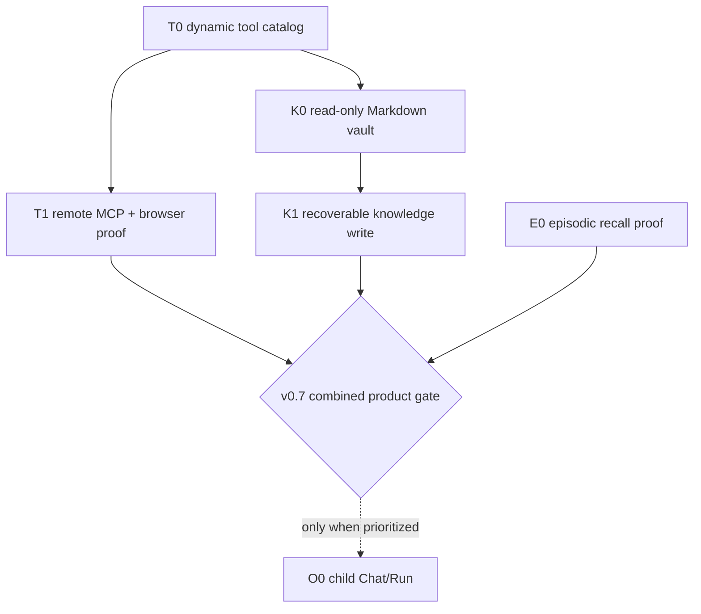

# Runnable Agent GitHub Issue Filing Plan

> Backlog direction, not an implementation RFC. Each implementor must inspect the then-current code and agree on a technical plan with Leo before coding. Exact schemas, state machines, file lists, and library details are intentionally deferred.

- **Date:** 2026-07-15
- **Status:** Executed on GitHub; O0 and optional #36 cleanup remain deferred
- **Version:** v0.5
- **Confidence:** High on ordering and issue boundaries; moderate on implementation details by design

## Decision

File **five required implementation issues**, not seven:

1. T0 — dynamic tool-catalog foundation;
2. T1 — instance-managed remote MCP tools, including browser acceptance;
3. E0 — minimal episodic-recall hardening;
4. K0 — read-only personal Markdown/Git vault;
5. K1 — one recoverable agent-authored knowledge write.

Keep the combined product loop as the v0.7 tracker/milestone exit gate, not a pre-filed test-only issue. File the optional child Chat task only when it is actually prioritized.

This corrects the earlier over-slicing:

- MCP runtime and its browser proof are one user-visible feature. A separate T2 issue would mostly create hand-off overhead.
- The combined MCP → KB → episodic scenario is a release criterion. Create a separate issue only if implementing that gate later proves to be substantial work.
- Tool-catalog work stays separate from MCP because it changes the contract used by every native and future tool.
- KB read and write remain separate because Git-backed writes introduce a materially different retry, recovery, and security boundary.

## Milestones and trackers

Reuse the existing mostly-empty planning objects:

| Existing object | Result                                                                                                        |
| --------------- | ------------------------------------------------------------------------------------------------------------- |
| Milestone #4    | Renamed to `v0.6: Remote MCP tools` and redescribed.                                                          |
| #40             | Rewritten as the v0.6 remote-MCP tracker; parent of #214 and #215.                                            |
| Milestone #5    | Renamed to `v0.7: Runnable personal knowledge agent` and redescribed.                                         |
| #39             | Rewritten as the v0.7 runnable-agent tracker; parent of #213 and #212 and owner of the combined release gate. |
| #194            | Refreshed the shipped baseline and added #216. #196–#198 remain open and deferred.                            |
| O0              | Intentionally not filed or assigned a milestone. File later only if child Chats become immediate work.        |

Do not preserve obsolete milestone descriptions under new names. Exact wording can be decided while filing; it only needs to state the outcome and major exclusions honestly.

## Issue set

| ID  | GitHub result | Title                                                             | Milestone | Blocked by                |
| --- | ------------- | ----------------------------------------------------------------- | --------- | ------------------------- |
| T0  | [#214]        | `refactor(api): support catalog-driven dynamic tool execution`    | v0.6      | —                         |
| T1  | [#215]        | `feat(api): run instance-managed Streamable HTTP MCP tools`       | v0.6      | #214                      |
| E0  | [#216]        | `feat(api): prove safe two-chat episodic recall`                  | v0.7      | —; builds on shipped #195 |
| K0  | [#213]        | `feat(api): let the agent search a personal Markdown vault`       | v0.7      | #214                      |
| K1  | [#212]        | `feat(api): land one recoverable agent-authored knowledge commit` | v0.7      | #213                      |
| O0  | Not filed     | `feat(api,web): launch one non-blocking child Chat/Run`           | none      | v0.7 exit gate            |

[#212]: https://github.com/leon0399/llame/issues/212
[#213]: https://github.com/leon0399/llame/issues/213
[#214]: https://github.com/leon0399/llame/issues/214
[#215]: https://github.com/leon0399/llame/issues/215
[#216]: https://github.com/leon0399/llame/issues/216

## Dependency graph

Solid arrows are formal blockers. The diamond is a tracker/milestone exit gate, not a separate issue.

T0 and E0 can start independently. K0 can start after T0 without waiting for a live MCP server. The useful mainline is T0 → T1 first, then K0 → K1.

## T0 — dynamic tool-catalog foundation

**Outcome:** The existing durable Run loop can consume native and dynamic tools through one injectable catalog without regressing `search_conversations`.

**Direction:**

- Preserve one execution path and the current durable tool-event model.
- Support dynamic JSON Schema tools as well as native schemas.
- Keep trusted Run identity and per-call metadata out of model-controlled arguments.
- Treat mutability and replay safety as separate properties so K1 does not reopen the tool contract.
- Propagate cooperative timeout/cancellation signals and settle tool history truthfully before a Run terminates.

**Done when:**

- Existing native-tool paths still pass.
- A test dynamic tool can be advertised, validated, called, and replayed from history.
- Invalid, unclassified, unsafe-to-replay, duplicate, or non-allowlisted tools fail closed.
- Cancellation/expiry does not leave a tool permanently rendered as running.

**Not now:** MCP transport, connector configuration, permission UI, or policy evaluation.

## T1 — instance-managed remote MCP tools

**Outcome:** An operator can configure a remote Streamable HTTP MCP server, and a normal chat can use an explicitly enabled read-only tool from it. Web search is the acceptance example, not a hard-coded connector.

**Direction:**

- Instance-managed configuration first; remote Streamable HTTP only.
- Namespace MCP tool IDs stably and keep them compatible with the existing allowlist.
- Discover and validate declared tools before advertising them.
- Keep native tools and answer-only chats usable when an MCP server is unavailable.
- Bound connection, discovery, call, reconnect, and shutdown behavior.
- Never log configured secret headers.
- Withdraw tools when their server disconnects; do not advertise a stale catalog.

**Done when:**

- A deterministic local MCP fixture covers discovery, call, result mapping, disconnect, and close.
- A browser chat invokes a generic MCP search tool, uses its result, and survives refresh/history replay.
- An environment-gated real web-search eval can return current sourced evidence without exposing credentials.
- Offline or malformed servers degrade only their own tools.

**Not now:** stdio, legacy SSE, OAuth, user-scoped configuration, write/send/delete tools, resources/prompts, management UI, or the readiness endpoint tracked by #203.

**Cross-links:** #179 if refresh resumes tool activity but loses the final answer; #203 for future readiness aggregation.

## E0 — minimal episodic-recall hardening

**Outcome:** The already-shipped `search_conversations` tool has one deterministic and safely framed recall scenario.

**Direction:**

- Treat recalled chat text as potentially stale historical data, never as fresh instructions.
- Add only enough prompt/tool guidance for explicit references to prior discussions.
- Prove recall across two Chats and preserve trusted tenant identity.

**Done when:**

- Chat B deliberately finds and answers a unique decision from Chat A.
- Instruction-shaped recalled text stays bounded as data.
- A second user cannot retrieve the first user's history.

**Not now:** embeddings, automatic injection, temporal-language parsing, recency ranking, or a new memory store.

Create E0 as a new #194 child. It does **not** replace or close #198; #198 remains the fuller temporal/provenance/recency task.

## K0 — read-only personal Markdown/Git vault

**Outcome:** The agent can search and read a user's canonical Git-backed Markdown vault without importing it into Postgres.

**Direction:**

- One operator-configured Home root with storage-safe per-user vault paths.
- Git/Markdown is canonical; reads use the accepted committed state, not uncommitted work.
- Provide small bounded `knowledge_search` and `knowledge_read` tools.
- Treat notes as untrusted and potentially stale; verify volatile claims with external tools.
- Safely accept or initialize an empty vault; refuse ambiguous non-empty non-repositories.
- Share only the required Home volume with the worker, never the host home.

**Done when:**

- A browser chat finds an existing note and cites its relative path.
- Cross-user access, traversal, symlinks, and oversized operations fail closed.
- Concurrent first use cannot create conflicting bootstrap history.

**Not now:** agent writes, indexing, embeddings, frontmatter schema, Notion/Obsidian adapters, shared KBs, or project routing.

## K1 — one recoverable agent-authored knowledge write

**Outcome:** When explicitly asked to retain or correct knowledge, the agent can change one Markdown file and land one visible, recoverable Git commit.

**Direction:**

- Gist-sized contract: one complete Markdown file per call, create-only or compare-and-swap update.
- One durable KB-write effect per Run; retries and worker crashes must not create duplicate commits.
- Isolate the change from human work, publish it atomically to the accepted state, and never overwrite dirty user work.
- Bound path/content size and reconcile filesystem/Git failures before reporting an outcome.
- Record trusted Run provenance in Git history.
- Register this first-party tool as write-low-risk and replay-safe without enabling arbitrary remote MCP writes.

The implementor must propose the concrete Git recovery design before coding. The issue should require the behavior above, not preselect a ref/worktree protocol prematurely.

**Done when:**

- Research can produce one sourced note and exactly one commit.
- A later correction uses compare-and-swap and creates one later commit; stale input changes nothing.
- Retry/crash/concurrent-writer tests show no duplicate or invisible write.
- A new Chat reads the landed note.
- Cross-user paths, invalid paths, and oversized writes fail closed.

**Not now:** multi-file patches, Jujutsu, automatic LLM review/merge, shared KBs, human-edit watchers, or generic artifact/project writes.

## v0.7 combined product gate — tracker checklist, not an issue

Before closing #39/milestone v0.7, prove this observable loop:

1. Chat A uses remote MCP search for current evidence.
2. Chat A stores a sourced Markdown note through K1.
3. Refresh/reopen preserves tool activity and the final answer.
4. Chat B retrieves the committed note from the vault.
5. Chat C recalls what happened in Chat A through episodic search.
6. A second user cannot read or write the first user's chat or vault.

Add this scenario to the last owning implementation PR if practical. File a separate integration issue only if the missing test infrastructure is genuinely substantial; do not pre-create bureaucracy.

## O0 — optional child Chat/Run

Do not put this in either active milestone yet.

If prioritized, the issue should deliver one ordinary inspectable child Chat/Run launched by a parent Run without waiting for it. It must reuse the same Chat/Run/tool architecture, record parent lineage and non-human authorship truthfully, enforce same-tenant parent/child integrity, survive retries without duplicate children, and let the user open and continue the child Chat.

Keep the first version to one delegation level. No wait/join/synthesis, live steering, workspace modes, Agent Profiles, ACP/A2A, or external harness sessions. #29 remains the separate ACP track.

## Existing issue and PR disposition

| Item                | Result                                                                                                        |
| ------------------- | ------------------------------------------------------------------------------------------------------------- |
| #39                 | Rewritten as the v0.7 runnable-agent tracker.                                                                 |
| #40                 | Rewritten as the v0.6 remote-MCP tracker.                                                                     |
| #194                | Refreshed shipped #195 and added #216; retained #196–#198 as deferred work.                                   |
| #195                | Keep closed; it is the shipped episodic-search foundation.                                                    |
| #196                | Keep open and deferred.                                                                                       |
| #197                | Kept open and deferred; now formally blocked by #196.                                                         |
| #198                | Keep open and deferred; E0 does not replace it.                                                               |
| #172                | Closed as superseded by shipped #195 plus #196/#197.                                                          |
| #186                | Closed as completed by #195/PR #202.                                                                          |
| #179                | Keep open; cross-link from T1 and the combined gate.                                                          |
| #203                | Keep open; readiness aggregation is not T1.                                                                   |
| #207                | Keep open; cross-process cancellation delivery is not T0.                                                     |
| #45 / draft PR #133 | Keep deferred; permission policy is outside this release.                                                     |
| #29                 | Keep separate; ACP is not native child Chats.                                                                 |
| Draft PR #146       | Closed as superseded after replacement issues were created. Its isolation/framing test ideas remain reusable. |
| #36                 | Left untouched. Optional backlog cleanup, not a prerequisite.                                                 |
| #46/#168            | No action in this batch.                                                                                      |

## Execution record

- [x] Renamed/redescribed milestones #4/#5 and rewrote trackers #40/#39.
- [x] Created #214 and #215 under #40; #215 is blocked by #214.
- [x] Created #216 under #194 and refreshed #194.
- [x] Created #213 and #212 under #39; dependency chain is #214 → #213 → #212.
- [x] Put the combined product gate checklist in #39.
- [x] Added the planned cross-links and the #196 → #197 dependency.
- [x] Closed only superseded #172, completed #186, and superseded draft PR #146, after replacement links existed.
- [x] Read the resulting GitHub state back and verified properties and relationships.
- [ ] O0 remains unfiled until Leo prioritizes it.
- [ ] Optional #36 cleanup remains untouched.

## Implementation handoff rule

Each issue defines an outcome boundary, not the final design. Before implementation, its owner should post a short plan covering current-code evidence, chosen mechanics, migration/security impact, and verification. If that plan changes another issue's contract, update the dependency first instead of silently expanding the PR.

## Revision history

- **v0.5 (2026-07-15):** Recorded the filed issues (#212–#216), rewritten trackers/milestones, live parent/dependency graph, deliberate O0/#36 deferrals, and narrowly scoped supersession/completion cleanup.
- **v0.4 (2026-07-15):** Removed implementation-RFC detail, merged MCP browser acceptance into T1, changed the combined scenario from a pre-filed issue into the v0.7 exit gate, and left exact mechanics for issue-level planning with Leo.
- **v0.3 (2026-07-15):** Adversarially reviewed seven-issue decomposition; useful source material, but too prescriptive for backlog planning.
